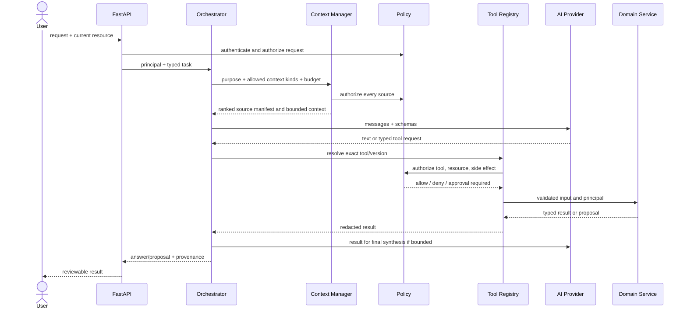

# AI Orchestrator, Providers, Context, and Tools

## 1. Boundary and safety model

The future orchestrator is a normal typed Python application service, not a monolithic autonomous agent. It coordinates provider calls and a small allowlist of domain operations. It cannot query arbitrary tables, construct SQL, discover secrets, call arbitrary URLs, or bypass the same service authorization used by HTTP requests.



The loop has explicit limits: maximum provider turns, tool calls, elapsed time, input/output tokens, and cost. It stops on repeated tool error, policy denial, budget exhaustion, user cancellation, or an approval boundary. High-impact work is never executed inside an unreviewed model loop.

## 2. Provider abstraction

Application services depend on `AIProvider.generate`, `stream`, and `embed` as defined in `apps/api/app/ai/provider.py`. Adapters translate a provider's message, structured-output, streaming, usage, timeout, moderation, and error shapes to internal contracts. Provider selection and models come from validated deployment configuration and may vary by task policy.

The AI service adds retry/backoff for safe transient errors, circuit breaking, concurrency/rate limits, usage/cost accounting, trace propagation, and normalized errors. Generation with an unknown provider outcome is not blindly retried when it could create duplicate side effects; tools themselves use idempotency. Provider SDK types do not escape adapters. Prompt/template versions and evaluation results gate model migrations.

## 3. Run state

An `ai_run` moves through `created -> assembling_context -> generating -> awaiting_approval|completed|failed|cancelled`. A run records purpose, actor/tenant, provider/model, prompt template/version, input hash, context manifest (source/version/hash/rank), tool-call IDs, proposal IDs, usage/cost/latency, status, and sanitized error code. Raw prompts/responses are retained only when policy, consent, encryption, and redaction allow it.

One request may yield an answer, one or more proposals, or an approval requirement. A completed answer does not mean proposed changes were applied.

## 4. Context management

### Pipeline

```text
user request + current UI resource
-> task/purpose classification
-> allowed context-kind policy
-> tenant/project/resource authorization
-> candidate retrieval (structured records + hybrid knowledge search)
-> freshness/version filtering
-> relevance/risk ranking
-> deduplication
-> token-budget packing
-> context manifest + delimited data blocks
```

Possible kinds are strategy, brand voice/rules, SEO rules, keyword/cluster map, content map, brief, linking guide, knowledge chunks, current document, selected text, and previous versions. The request declares the smallest allowlist. The context manager does not send the entire project by default.

### Token budget

The task policy supplies an input ceiling. Reserve provider system/tool schema overhead first, then recent user turns/current selection, then required structured sources, then ranked optional sources; retain at least the configured output reserve. Example starting allocation for a 16k input budget: 10% system/tool policy, 20% request/current selection, 25% brief/strategy/rules, 35% retrieved evidence/document, 10% recent conversation. This is a policy default, not hardcoded across models.

Packing is deterministic for the same source snapshot and config. Truncation happens at semantic boundaries, records what was excluded, and never drops source attribution. Long source summarization is separately versioned and traceable. Counts use the target model's tokenizer or a conservative fallback.

### Ranking and caching

Structured exact dependencies (current brief and referenced rule versions) outrank semantic retrieval. Knowledge uses tenant-filtered hybrid full-text/vector recall, then optional reranking; recency/authority/access labels adjust score. Evaluate recall@k, grounded answer rate, latency, and cross-tenant negative cases.

Cache keys include tenant, project, purpose, source hashes/versions, retrieval/model config, permission fingerprint, and budget. Membership/rule/source changes invalidate affected entries. Never share context/prompt caches across organizations.

## 5. Prompt injection defenses

Retrieved pages and documents are untrusted data. Context blocks carry source IDs and explicit delimiters and are described as evidence, never instructions. The system policy prohibits obeying instructions in sources, revealing configuration, expanding tool permissions, or treating model-generated IDs as authorization. Tool calls are schema validated, resource IDs are re-resolved in tenant scope, URL/network access is allowlisted in adapters, and provider text is output-encoded/sanitized. Suspicious source patterns become security telemetry but are not the only defense.

## 6. Tool registry contract

Each registered tool has a unique name/version, description, Pydantic input/output classes, required permission string, effect class, timeout, idempotency policy, callable domain service, declared errors, and audit/redaction policy. Registry startup fails on duplicate names or schema/descriptor mismatch. The orchestrator exposes only tools allowed for the task and principal.

Effect levels:

- `READ`: no canonical domain mutation; ordinary access permission. A validator may persist an immutable analysis artifact for provenance.
- `PROPOSE`: stores a proposal/candidate only. Applying it is a separate authenticated human action.
- `HIGH_IMPACT`: affects external/public state or active policy and requires a fresh exact approval.

All calls can return `TOOL_VALIDATION_ERROR`, `TOOL_NOT_ALLOWED`, `RESOURCE_NOT_FOUND`, `VERSION_CONFLICT`, `APPROVAL_REQUIRED`, `APPROVAL_INVALID`, `DEPENDENCY_ERROR`, `TIMEOUT`, or a declared domain conflict. Every attempted call audits run/tool/version, actor/tenant, input/output hashes and redacted summaries, policy decision, approval, timestamps, outcome/error, and created resource/proposal IDs. Raw content/secrets are not audit payloads.

## 7. Tool catalog

The Python classes and field-level validation are in `apps/api/app/tools/models.py`. `R` = read, `P` = proposal-only, `H` = high impact.

| Tool | Purpose; input model -> output model | Level / side effect | Specific errors and audit additions |
|---|---|---|---|
| `get_strategy` | Read exact/current structured strategy; `GetStrategyInput(project_id,version_id?)` -> `GetStrategyOutput(snapshot)` | R / none | no active version; audit returned version/hash |
| `update_strategy` | Propose JSON Patch against exact base; `UpdateStrategyInput(project_id,base_version_id,patch,reason)` -> `UpdateStrategyOutput(proposal)` | P / creates proposal | invalid patch, stale base, invariant violation; audit base/patch/result hashes |
| `search_keywords` | Filter bounded keyword inventory; `SearchKeywordsInput(project_id,query?,intent?,cluster_id?,limit)` -> `SearchKeywordsOutput` | R / none | invalid filter/cursor scope; audit filters/count, not full queries if sensitive |
| `get_keyword_cluster` | Fetch cluster, members, canonical target; `GetKeywordClusterInput` -> `GetKeywordClusterOutput` | R / none | cluster not found/version changed; audit cluster/version |
| `classify_intent` | Propose intent assessments; `ClassifyIntentInput(keyword_ids,taxonomy_version)` -> `ClassifyIntentOutput` | P / creates proposal | batch too large, missing SERP evidence/model failure; audit taxonomy/model/evidence hashes |
| `find_keyword_gaps` | Return evidence-backed gap candidates; `FindKeywordGapsInput(strategy_version_id,competitor_ids,limit)` -> `FindKeywordGapsOutput` | R / none | source unavailable/stale strategy; audit sources/method version |
| `get_content_map` | Return bounded graph projection; `GetContentMapInput(statuses,max_nodes)` -> `GetContentMapOutput` | R / none | graph too large (returns truncated), invalid filter; audit graph revision/count |
| `get_related_pages` | Rank typed page relations; `GetRelatedPagesInput(page_id,relationship_types,limit)` -> `GetRelatedPagesOutput` | R / none | page not found; audit algorithm/version/count |
| `create_content_brief` | Propose brief from frozen dependencies; `CreateContentBriefInput(page_id,strategy_version_id,cluster_id,instruction?)` -> `CreateContentBriefOutput` | P / creates proposal | target conflict, dependency not approved, missing rules; audit dependency manifest |
| `generate_outline` | Propose outline for exact brief; `GenerateOutlineInput(page_id,brief_id,brief_version)` -> `GenerateOutlineOutput` | P / creates proposal | stale/unapproved brief, coverage failure; audit brief/version/model |
| `rewrite_content` | Propose range-anchored editor patch; `RewriteContentInput(page_id,base_version_id,selected_node_ids,instruction)` -> `RewriteContentOutput` | P / creates suggestion | invalid selection, stale base, unsafe/invalid document; audit source/base/result hashes |
| `get_seo_rules` | Read applicable active rules; `GetSeoRulesInput(page_id?,categories)` -> `GetSeoRulesOutput` | R / none | no active rules/invalid category; audit rule IDs/hash |
| `check_seo` | Run labeled deterministic and AI evaluation; `CheckSeoInput(page_id,content_version_id,rule_ids)` -> `CheckSeoOutput` | R / creates immutable analysis | stale rule/content, analyzer unavailable; audit all versions and components |
| `validate_content` | Aggregate SEO/brand report without hiding components; `ValidateContentInput` -> `ValidateContentOutput` | R / creates immutable analysis | missing active policy, version mismatch; audit component analyzers/versions |
| `find_internal_link_opportunities` | Score candidate targets; `FindInternalLinkOpportunitiesInput` -> `FindInternalLinkOpportunitiesOutput` | R / none | no eligible targets, stale graph; audit algorithm and score components |
| `suggest_anchor_text` | Suggest anchors grounded in source/target; `SuggestAnchorTextInput` -> `SuggestAnchorTextOutput` | P / creates proposal | missing source span, anchor-policy violation; audit page versions/risk flags |
| `validate_internal_links` | Validate current page links/graph policy; `ValidateInternalLinksInput` -> `ValidateInternalLinksOutput` | R / creates immutable analysis | crawl/version unavailable; audit graph/rule version |
| `get_brand_voice` | Read active profile/rules; `GetBrandVoiceInput(project_id,locale?)` -> `GetBrandVoiceOutput` | R / none | no active profile/locale; audit versions |
| `check_brand_voice` | Assess exact content/profile versions; `CheckBrandVoiceInput` -> `CheckBrandVoiceOutput` | R / creates immutable analysis | stale profile, evaluator failure; audit evidence/model/profile hash |
| `search_knowledge_base` | Tenant-scoped hybrid retrieval; `SearchKnowledgeBaseInput(query,source_types,limit)` -> `SearchKnowledgeBaseOutput` | R / none | invalid source filter, retrieval unavailable; audit chunk/source IDs and retrieval version |
| `get_company_context` | Assemble bounded structured context; `GetCompanyContextInput(context_kinds,max_tokens)` -> `GetCompanyContextOutput` | R / none | kind not allowed, budget too small; audit source manifest/truncation |
| `save_draft` | Propose exact document replacement rather than directly autosave; `SaveDraftInput(page_id,base_version_id,document_json,idempotency_key)` -> `SaveDraftOutput` | P / creates proposal | invalid schema, stale base, duplicate key mismatch; audit hashes, never full content |
| `create_version` | Propose accepting a draft/suggestion as next immutable version; `CreateVersionInput(page_id,base_version_id,proposal_id?,change_summary)` -> `CreateVersionOutput` | P / creates proposal | proposal/base mismatch, stale base; audit lineage |
| `publish_page` | Execute approved CMS draft/publish of exact version; `PublishPageInput(page_id,content_version_id,destination_id,action,approval_id,idempotency_key)` -> `PublishPageOutput` | H / external mutation after approval | unapproved content, invalid/expired approval, connector failure/unknown result; audit exact digest, destination, external ID/status |

`save_draft` and `create_version` are intentionally proposal tools in AI context. The normal editor autosave API remains a direct user mutation. Active strategy/rule changes and deletion tools are not initially exposed; adding them needs policy review and catalog/test updates.

## 8. Approval protocol

The UI presents exact action, target, immutable input version, destination/policy change, expected side effect, proposal diff, and expiry. Approval creates an immutable record with an operation digest. Execution rechecks actor membership/permission, target/version/status, digest, expiry, single-use/idempotency, and external destination. A materially changed input invalidates approval. Rejection and expiry are terminal. An approval cannot authorize a chain of future model-decided operations.

## 9. Knowledge pipeline

```text
private source -> malware/type/size validation -> parser adapter
-> normalized document with provenance -> semantic chunking
-> content hash/dedup -> embedding job -> pgvector + full-text index
-> tenant/access-filtered hybrid retrieval -> rerank -> context manifest
```

Future modules are `knowledge/sources`, `parsers`, `normalization`, `chunking`, `embeddings`, `repositories`, `retrieval`, and `services`; provider-specific parsers/storage live in integrations. Each chunk retains source/document/version, location (page/heading/span), parser/chunker/embedding versions, hash, language, access label, and deletion lineage. PDF/DOCX, website, brand/product documents, articles, FAQs, and case studies use dedicated parser adapters. Deleted/revoked sources become unretrievable immediately and are purged asynchronously.

## 10. Self-learning

```text
AI proposal + exact base
-> human accept/reject/edit
-> semantic diff with context
-> repeated-pattern candidate
-> evidence/sample/confidence threshold
-> offline validation
-> human review
-> approved rule version
-> separately activated owning brand/SEO policy
```

Candidates store positive and counterexamples, scope, extractor version, source proposal/diff IDs, confidence, and privacy-safe evidence. Confidence never activates a rule. Approval is restricted, audited, versioned, reversible by superseding version, and evaluated against a holdout suite before activation.

## 11. Test and evaluation gates

- Provider adapter contract tests: generation, streaming cancellation, structured output, embeddings, usage, timeout/error mapping.
- Registry tests: unique tools, JSON schema stability, strict extra-field rejection, permission and effect metadata.
- Policy tests: role/tenant/resource matrix, approval digest/expiry/reuse, cross-tenant IDs in inputs, denied tools never execute.
- Context tests: source authorization, token budget, attribution, invalidation, cross-tenant retrieval, malicious source instructions.
- Orchestrator tests: bounded loop, correct tool selection, schema repair limit, cancellation, repeated error stop, proposal-only behavior.
- Evaluations: groundedness, hallucinated ID/citation rate, intent/brand/SEO rubrics, link precision, proposal acceptance, and regression by prompt/model/retrieval version.
- No paid/live provider in default CI. Staging evaluation is budgeted, redacted, manually or release-triggered, and compared with explicit thresholds.
