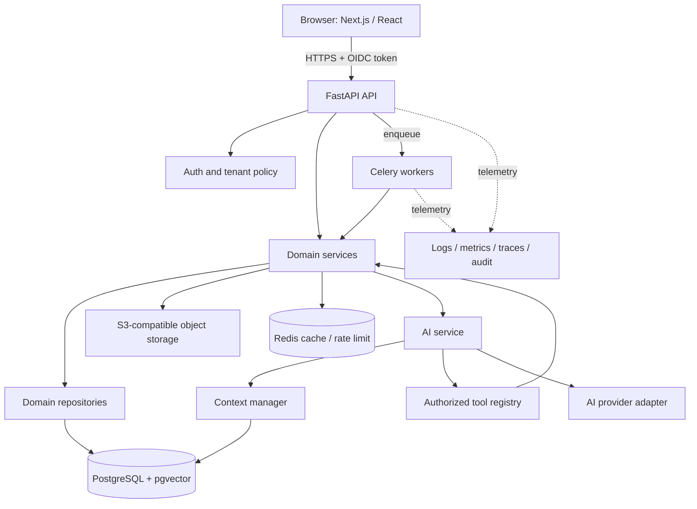

# System Architecture

## 1. Architecture at a glance

The first production shape is a domain-oriented modular monolith. It minimizes operational overhead for two developers while preserving service boundaries that can later be extracted from evidence.



PostgreSQL is canonical for business state, graphs, versions, audits, AI runs, and embeddings. Redis is never the sole store for durable status. Object storage keeps private source binaries and large exports; metadata and ownership remain in PostgreSQL.

## 2. Architectural decisions

| Decision | Why / dependency / tradeoff | Evolution and test |
|---|---|---|
| Modular monolith | Fast iteration and atomic transactions with explicit domain ownership; risks accidental coupling | architecture import checks; extract only on measured independent scaling, isolation, or team ownership |
| Async FastAPI + SQLAlchemy `AsyncSession` | One consistent non-blocking HTTP path for DB and providers; async requires discipline | repository integration tests and pool/latency metrics; CPU work moves to Celery |
| PostgreSQL + JSONB + pgvector | Transactions, relationships, flexible snapshots, and vector retrieval in one tenancy boundary; not infinite vector scale | query plans, recall/latency evaluation; external vector store only after accepted ADR and scale evidence |
| Relational content graph | Graph is moderate and strongly connected to pages/rules/tenancy; recursive SQL is sufficient | graph integrity/property tests; evaluate graph DB only when traversal requirements exceed Postgres |
| Celery + Redis | Mature Python job ecosystem and adequate MVP operational model; delivery is at-least-once | idempotent jobs, durable DB job record, retries/dead letters; revisit when workflow durability needs orchestration engine |
| Structured/versioned JSON | Supports editor/rules/strategy evolution and exact replay; needs schema migrations | schema-version fixtures and upcasters; normalize fields that become query/integrity critical |
| OIDC identity + internal RBAC | Avoids custom credential risk while retaining product permissions; introduces provider dependency | token validation and policy tests; adapter boundary permits provider change |
| OpenAPI-generated TypeScript | Lets two developers work against stable contract; generation can drift | snapshot/diff CI and contract tests |

ADRs under `docs/adr` contain full alternatives and consequences.

## 3. Python backend architecture

### Request and transaction path

```text
HTTP request
-> FastAPI router (parse only)
-> Pydantic request validation
-> authentication dependency
-> tenant/resource authorization dependency
-> domain application service
-> domain repository using injected AsyncSession
-> PostgreSQL
-> Pydantic response mapping
-> response envelope
```

Routers do not make ORM queries or decide business status transitions. Repositories encapsulate query shape and tenant predicates. Services enforce invariants and own the unit of work; repositories `flush` when IDs are needed but never commit. Provider adapters translate external protocols and errors, but never decide product rules.

### Domain modules and dependencies

| Domain | Owns | May depend on |
|---|---|---|
| `projects` | organizations, memberships, project lifecycle and settings | security primitives |
| `websites` | site identities, domain verification, connector config refs | projects, integrations |
| `strategy` | strategy identity, versions, approval | projects, websites |
| `brand` | brand profiles/rules/analyses | projects, strategy, knowledge, AI interface |
| `keywords` | keywords, metrics, intent, clusters, assignments/conflicts | projects, websites, jobs, AI interface |
| `content` | pillars, topics, pages, briefs, editor docs/versions/comments/proposals | strategy, brand, keywords, SEO/link public services |
| `content_map` | graph query/command facade and saved layouts | content, keywords, internal_linking |
| `seo` | rule sets, deterministic engine, AI assessment facade | websites, content, AI interface |
| `internal_linking` | linking rules, link edges/opportunities and scoring | content, SEO, keywords |
| `knowledge` | sources, documents, chunks, embeddings, retrieval | projects, websites, storage, jobs, AI provider embed |
| `ai` | runs, context policy, provider facade, tool calls/proposals | public domain services, security, observability |
| `learning` | feedback, candidates, approved rules | AI, content, brand, SEO |
| `publishing` | destinations, publication runs, adapter state | content, websites, security, integrations |
| `analytics` | performance metrics/imports and read models | websites, content, jobs |

Dependencies should be acyclic at the service layer. When two domains react to one transition, the owner commits state plus an outbox event in the same transaction; an idempotent handler builds the other domain's projection. In-process calls are preferred for required synchronous invariants.

### Shared layers

- `core`: IDs, clock, domain errors, event primitives; no product domain imports.
- `config`: Pydantic settings and dependency wiring.
- `db`: base metadata, sessions, model registry, outbox mechanics.
- `security`: token verification, principal, tenant scope, RBAC/tool policies.
- `observability`: structured logging, trace/metric setup, immutable audit writer.
- `integrations`: OIDC, AI, object storage, keyword/analytics/CMS adapters.
- `workers`: Celery task adapters that validate job payload then call services.

### Exceptions

Domain services raise typed errors such as `NotFound`, `PermissionDenied`, `Conflict`, `InvalidTransition`, `PreconditionFailed`, and `ExternalDependencyUnavailable`. One API handler registry maps them to the stable error catalog in [API.md](API.md). Never leak SQL, provider payloads, prompts, or stack traces to clients.

## 4. Frontend architecture

Next.js supplies routing, server-side shell rendering, authentication session coordination, and API proxying where needed. React feature modules own page composition and client state. Tailwind provides tokens/utilities; `packages/ui` contains reusable presentation components only.

```text
app/ routes and layouts
-> src/features/<domain>/ screens, hooks, state, validation
-> src/lib/api generated contract + reviewed fetch transport
-> FastAPI /api/v1
```

- Server state uses a query cache with keys that include organization/project and invalidates on mutations; the library is selected in Phase 1.
- Local transient UI state stays local. Do not duplicate canonical domain data in a global store.
- Server Components must not receive long-lived provider secrets. Protected backend calls use the user's scoped session.
- Accessibility: keyboard operation, focus management, WCAG 2.2 AA contrast, semantic labels, and non-visual equivalents for graph operations.
- Errors preserve request ID and actionable error code. Optimistic mutations must have rollback behavior.

### Content Map UI

React Flow renders the API's graph projection but never becomes canonical. Layout coordinates are a per-user or shared saved view. Dragging a node changes layout only; relationship mutations call explicit edge APIs and pass the graph revision. Details and non-visual tables use the same graph response. See [CONTENT-MAP.md](CONTENT-MAP.md).

### AI editor UI

TipTap uses a pinned node/mark allowlist and document schema version. Autosave sends debounced structured JSON plus base version/hash; a service worker/offline buffer is optional later. AI output appears as an attributed suggestion/diff, never silently in the canonical document. Accept/reject/comment actions are explicit and auditable. Rendering sanitizes derived HTML, even though stored JSON is schema-validated.

## 5. Data and graph architecture

Normalized entities hold identity, ownership, relationships, status, and queryable facts. JSONB holds versioned structured documents, provider snapshots, rule parameters, and editor content. It must include `schema_version` and be validated at the application boundary. Important relationships use foreign keys, uniqueness, and check constraints.

The content graph is a projection across pillars, topics, keyword clusters, pages, and typed relationships. Internal links use a dedicated directed edge table because their lifecycle, anchors, evidence, and observed/published state differ from hierarchy. Graph reads may use recursive CTEs and materialized/read-model projections once profiling justifies them.

Detailed entities and isolation rules are in [DATABASE.md](DATABASE.md).

## 6. AI architecture

Business logic calls an `AIService`, which selects an `AIProvider` adapter through deployment configuration. The context manager classifies requested context kinds, authorizes each source, retrieves/ranks within the tenant, fits a token budget, and returns source IDs/hashes. The orchestrator allows only registered Pydantic tool schemas and re-authorizes at execution.

All generated content is untrusted. Provider output is schema-validated; cited sources, base versions, and rule versions are recorded; proposed changes require a user decision. High-impact tool calls require a fresh approval record bound to actor, exact operation digest, resource, and expiry. See [AI-ORCHESTRATOR.md](AI-ORCHESTRATOR.md).

## 7. Background jobs

| Job type | Input reference | Durable output | Retry/idempotency |
|---|---|---|---|
| keyword clustering | import/keyword snapshot + config version | proposed cluster set/version | unique operation key; deterministic seed where possible |
| website crawl | website + crawl config | crawl run, pages, observed links | URL/run dedupe; bounded retry |
| content analysis | page version + rule versions | immutable findings | content/rule hash key |
| document ingestion | knowledge source object version | documents/chunks | object checksum/parser version key |
| embedding generation | chunk IDs + embedding model | vectors/model/version | chunk hash/model key |
| AI generation | AI run + context manifest | result/proposals/usage | no blind replay after unknown provider outcome |
| SEO analysis | content version + rule set | analysis | version tuple key |
| performance import | integration + date/window | normalized metric rows/import run | source/account/date key and upsert |
| refresh analysis | metric/content snapshots | reviewable candidates | snapshot/config key |

API creates a `job_run` in PostgreSQL and enqueues its ID after commit through the transactional outbox. Celery delivery is at-least-once, so a worker claims a state transition atomically, heartbeats long work, and checks cancellation. State is `queued -> running -> succeeded|failed|cancelled`; retry attempts and sanitized errors are durable. Redis results are operational cache only.

## 8. Caching

- Cache only derived or external data with explicit TTL and versioned keys.
- Keys include environment, organization, project, resource/version, and policy/model version where relevant.
- Authorization is performed before any cached payload is returned.
- Strategy/rule activation and membership changes publish invalidation events.
- AI context caches store source manifests/hashes and assembly results, not cross-tenant prompts. Sensitive raw content is avoided or encrypted under the same retention rules.
- Correctness never depends on cache eviction.

## 9. Observability and audit

Structured logs carry timestamp, level, service, environment, request/trace ID, actor ID (pseudonymous), organization/project IDs, route/job/tool, duration, outcome, and error code. They exclude tokens, secrets, full prompts, uploaded text, and sensitive provider responses.

Metrics include API latency/error/rate limits, pool saturation and slow queries, Celery queue age/retry/failure, provider latency/token/cost/error, tool calls/denials, context truncation/retrieval quality, proposal accept/reject, SEO finding counts, publication failures, and import freshness. OpenTelemetry traces connect HTTP -> service -> DB/outbox -> worker -> provider. Audit events are append-only business/security records with before/after references or hashes, not log lines.

## 10. Deployment environments

Local, test, staging, and production have separate databases, buckets, Redis namespaces, identity clients, AI keys, and telemetry destinations. Containers run API and worker from one versioned backend image with different commands. Migrations run once as a release job before compatible application rollout. Health endpoints distinguish liveness from readiness; readiness checks required dependencies without exposing configuration.

Zero/low-downtime schema change uses expand -> deploy compatible code -> backfill -> enforce -> contract. Destructive operations require explicit review, backup/restore evidence, and rollback/forward plan.

## 11. Extraction criteria

A module becomes a service only when at least two signals persist: independent load profile that cannot be handled by queues/replicas; separate availability/security boundary; independent release cadence/team ownership; database contention with a clear bounded data owner; or compliance/network isolation. Before extraction define API/event contract, ownership and data migration, consistency model, failure handling, SLO, cost, and rollback. Likely early candidates are crawling/document ingestion or AI job workers—not core project/content transactions.

## 12. Parallel development contract

Developer 1 owns Python, PostgreSQL, jobs, AI/provider/tool contracts, algorithms, and integrations. Developer 2 owns Next.js, generated client, React Flow, TipTap, accessibility, and UX. They synchronize through reviewed Pydantic/OpenAPI schemas, example fixtures, error codes, permission matrix, version/precondition headers, and an API mock generated from the committed OpenAPI snapshot. Contract changes land before dependent frontend work; both developers review cross-boundary changes.

