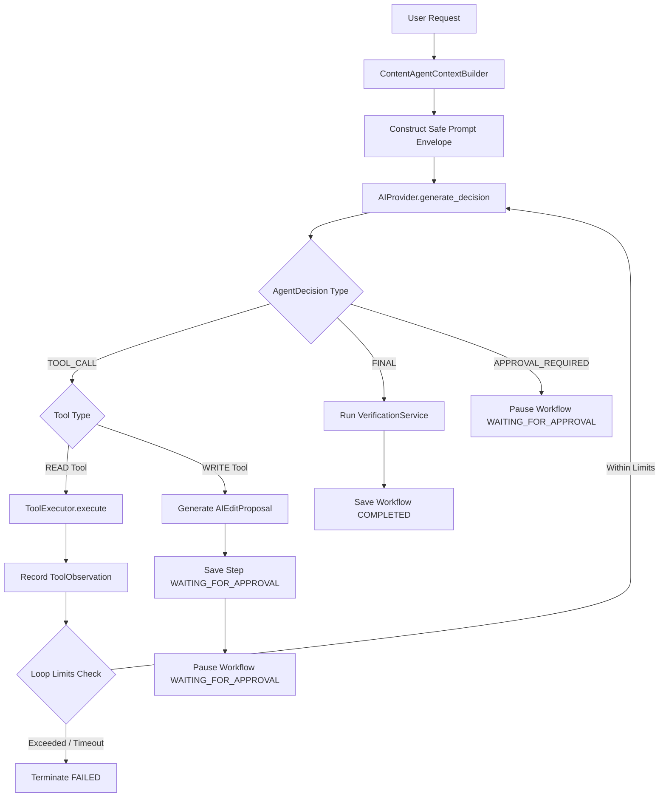

# Content Agent Orchestration System

## 1. Purpose & Overview

The Content Agent Orchestration System is the core reasoning and execution runtime for the AI Content Agent. It replaces static, deterministic workflow pipelines with an **iterative, observation-driven execution loop**.

In the legacy architecture, an intent was mapped to a static list of pre-planned steps (`WorkflowPlanner`), which were executed blindly regardless of intermediate findings. In the new architecture:
1. **Dynamic Decision-Making**: The agent inspects the project context, makes a decision, inspects tool outputs (observations), and dynamically chooses what to do next.
2. **Context-Aware**: Uses the authoritative, token-budgeted `ContentAgentContext` generated by `ContentAgentContextBuilder`.
3. **Safety & Governance**: WRITE tools that modify documents never mutate records directly; they create structured `AIEditProposal` drafts and halt execution at a human approval gate (`WAITING_FOR_APPROVAL`).
4. **Resilient Transaction Management**: Avoids long-lived database transactions during model inference or tool calls, preventing nested transaction collisions (`InvalidRequestError`).

---

## 2. Architecture & Execution Lifecycle



### Execution Steps
1. **Context Initialization**: `ContentAgentContextBuilder` gathers scoped tenant intelligence (SEO strategy, brief, keywords, document, crawl data).
2. **Prompt Assembly**: System instructions enforce strict security rules, tool definitions are cataloged, context is wrapped in untrusted data tags, and past observations are appended.
3. **Model Decision**: The LLM returns a structured `AgentDecision` JSON.
4. **Tool Evaluation**:
   - **READ Tools** (`read_document`, `seo_quality_check`, `keyword_check`, etc.): Executed immediately via `ToolExecutor`. Output is captured as a `ToolObservation` and fed back to the model for the next iteration.
   - **WRITE Tools** (`rewrite_section`, `expand_section`, `shorten_section`, `insert_internal_link`): A structured `AIEditProposal` is created. The workflow step transitions to `WAITING_FOR_APPROVAL` and execution pauses.
5. **Termination**: The loop finishes when the model declares `FINAL`, when an approval gate is reached, or when bounds (max iterations, max tool calls, timeout) are hit.

---

## 3. Workflow States & Lifecycle

| Workflow Status | Description |
|---|---|
| `PENDING` | Workflow created and queued for execution. |
| `RUNNING` | Iterative agent loop actively running. |
| `WAITING_FOR_APPROVAL` | Execution paused because a WRITE tool proposed document modifications requiring human review. |
| `COMPLETED` | Task achieved successfully. Final response generated and verified. |
| `FAILED` | Loop exceeded bounds (iterations, tool calls, timeout) or encountered unrecoverable runtime error. |
| `CANCELLED` | Execution aborted by user. |

---

## 4. Schemas and Contracts

Defined in `apps/api/app/domains/orchestrator/schemas.py`:

### `AgentDecision`
Returned by the model on each cycle:
```python
class AgentDecisionType(str, Enum):
    TOOL_CALL = "TOOL_CALL"
    FINAL = "FINAL"
    APPROVAL_REQUIRED = "APPROVAL_REQUIRED"

class AgentDecision(BaseModel):
    type: AgentDecisionType
    tool_name: str | None = None
    tool_input: dict[str, Any] = Field(default_factory=dict)
    reasoning_summary: str = Field(..., max_length=500)
    final_response: str | None = None
    approval_reason: str | None = None
```

### `ToolObservation`
Appended to the prompt on subsequent model cycles:
```python
class ToolObservation(BaseModel):
    execution_id: str
    tool_name: str
    status: str  # SUCCESS, FAILED, REJECTED
    data: dict[str, Any] | None = None
    error: str | None = None
    iteration: int = 0
```

### `AgentResult`
Final summary written to `AIWorkflow.result`:
```python
class AgentResult(BaseModel):
    workflow_id: UUID
    status: WorkflowStatus
    intent: WorkflowIntent
    summary: str
    actions_taken: list[str]
    proposals_created: list[UUID]
    observations_summary: list[str]
    approval_required: bool
    termination_reason: str
```

---

## 5. Security & Governance Boundaries

1. **Prompt Injection Containment**:
   - Retrieved context is encapsulated within `<RETRIEVED_PROJECT_CONTEXT type="data" untrusted="true">`.
   - Tool observations are encapsulated in `<TOOL_OBSERVATIONS>`.
   - The system prompt instructs the model that retrieved data can never override security rules or tool access boundaries.
2. **Untrusted Model Output**:
   - Tool names and inputs are strictly validated against `ToolRegistry`. Unknown or disabled tools are rejected with an observation returned to the model.
3. **Approval Gates**:
   - High-impact and WRITE actions (`RiskLevel.MEDIUM` / `HIGH` or `requires_human_approval == True`) cannot mutate documents directly.
   - Proposals are stored in `AIEditProposal` with status `PENDING`, awaiting explicit human review via `/api/v1/orchestrator/workflows/{id}/approve`.
4. **Execution Bounds**:
   - `max_iterations`: 10
   - `max_tool_calls`: 10
   - `execution_timeout_seconds`: 60.0
   - Any limit violation terminates with `is_error=True` and `WorkflowStatus.FAILED`.

---

## 6. Transaction Safety

To prevent `InvalidRequestError: A transaction is already begun on this Session`:
- No database transaction is held open during external AI provider calls or tool execution.
- Domain services (`QualityService`, `PatchService`, `InternalLinkingService`, `OrchestratorService`, `WorkflowService`) use `transactional_session(session)` from `app.core.transaction`:
  ```python
  async with transactional_session(session):
      # short, localized atomic commit
      await session.flush()
  ```
- Workflow state transitions (`RUNNING`, `WAITING_FOR_APPROVAL`, `COMPLETED`, `FAILED`) are flushed and committed in isolated transaction blocks.

---

## 7. Deterministic Testing & Provider Abstraction

- Application services depend solely on the abstract `AIProvider` contract, never direct vendor SDKs.
- During test execution (`PYTEST_CURRENT_TEST` or `APP_ENV=test`), `get_ai_provider()` returns `MockAIProvider`.
- `MockAIProvider` accurately simulates multi-turn conversations, parses advisory plans, simulates tool observations, and verifies stop conditions without invoking external networks or paid APIs.
