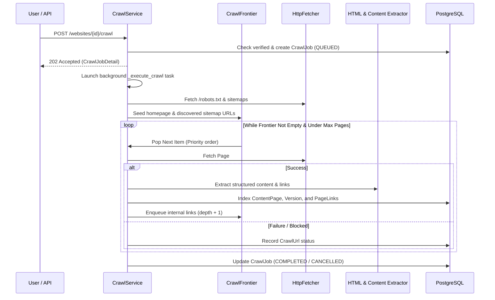

# Crawler Technical Guide

## 1. Safety & Architecture Principles

The crawler is designed for deterministic, resource-bounded, and SSRF-safe crawling:

1. **Static HTTP Fetching**: Uses `httpx` async client without server-side browser execution.
2. **SSRF Protection**: Resolves DNS before connection and checks IP against RFC 1918, RFC 3927, loopbacks, and cloud metadata IPs (`169.254.169.254`, `metadata.google.internal`). Redirects are revalidated on each hop.
3. **Response Bounds**: Rejects responses over 5 MB to prevent memory exhaustion and zip-bomb style attacks.
4. **Politeness & Rate Limiting**: Defaults to 200ms delay between requests and honors `Crawl-delay` and `Disallow` rules from `robots.txt`.
5. **Deduplication & Depth Control**: URLs are normalized deterministically (scheme/host lowercasing, fragment stripping, port stripping, query sorting) and tracked to prevent infinite crawl loops.

---

## 2. Crawl Workflow

---

## 3. Frontier & Prioritization

The frontier organizes discovered URLs into two queues:
1. **Priority Queue**: Seed URLs and XML Sitemap URLs (processed first).
2. **Standard Queue**: Discovered internal hyperlinks (processed in BFS order by crawl depth).
