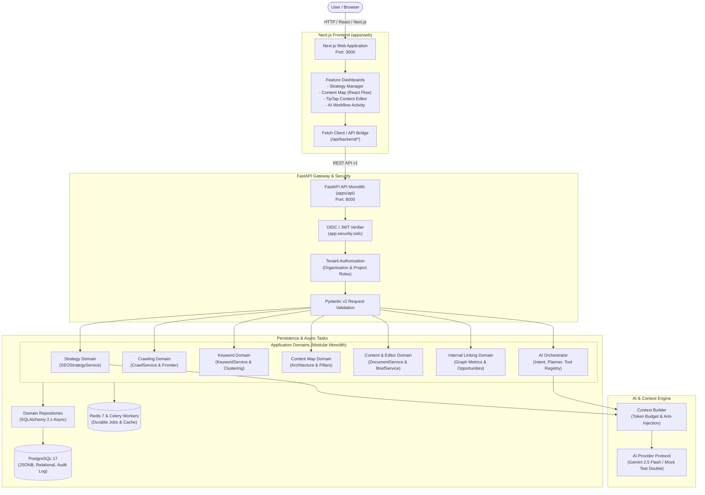
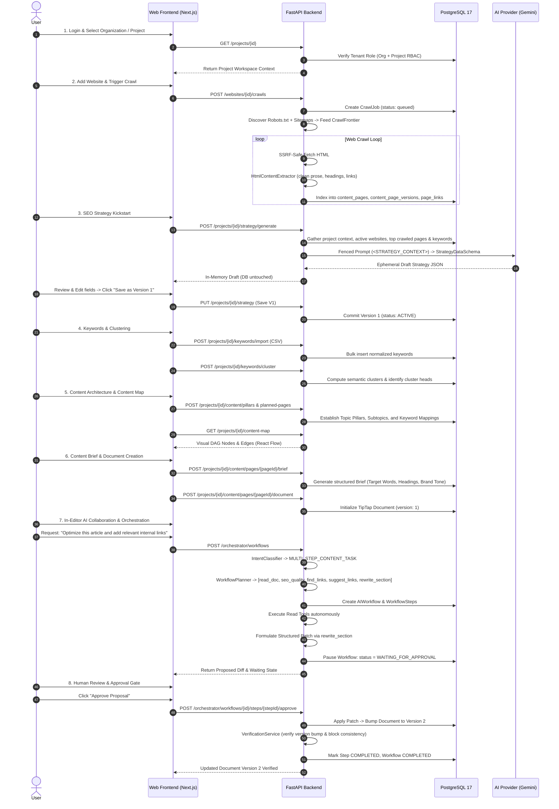
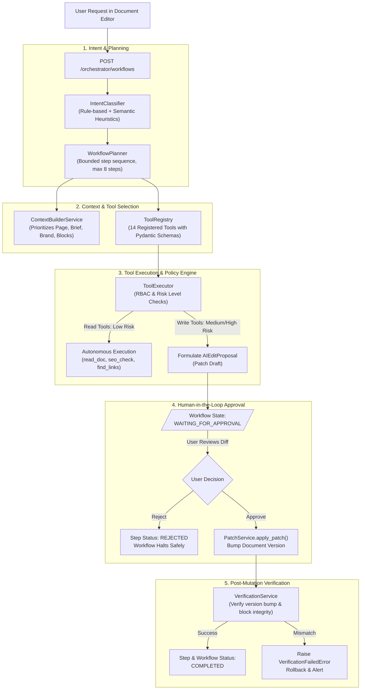
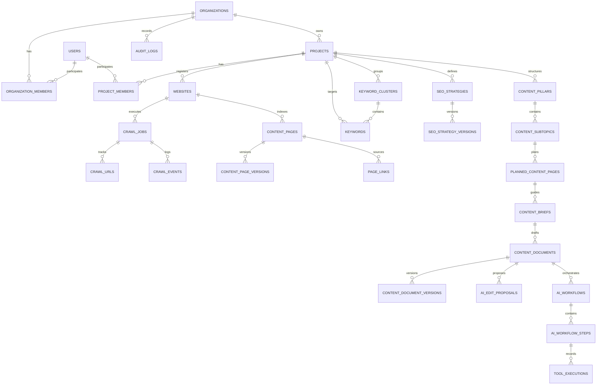
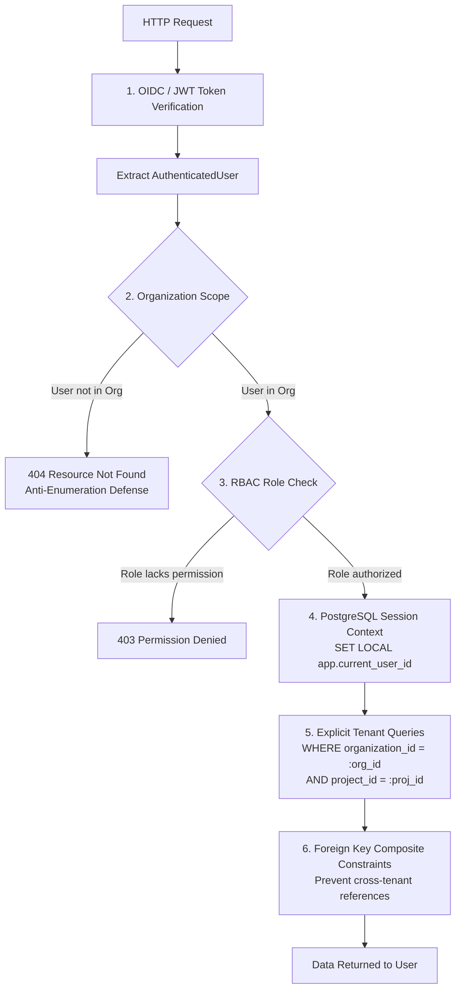

# Current System Architecture & Backend Logic Audit

## 1. Executive Summary

This document provides an architectural layout and detailed backend logic explanation of the **AI-powered SEO Content Intelligence & Content Operating System** (Phases 1 through 6).

The system transforms raw domain context into structured strategy, keyword intelligence, topic architectures, content briefs, governed AI editor proposals, autonomous multi-step orchestrations, and publication-ready records. PostgreSQL serves as the source of truth; prose documents and visual interfaces are representations of structured relational models.

### Implementation Status by Domain
- **Phase 1: Tenant & Workspaces (Organizations, Projects, Websites, RBAC)** — ✅ **IMPLEMENTED**
- **Phase 2: Crawling & Ingestion (Robots, Sitemaps, SSRF fetcher, HTML extractor, Page indexing)** — ✅ **IMPLEMENTED**
- **Phase 3: Intelligence & Strategy (Keywords, Clustering, SEO Strategy V1 with AI kickstart)** — ✅ **IMPLEMENTED**
- **Phase 4: Content Architecture & Linking (Pillars, Subtopics, Content Map, Link graph analysis)** — ✅ **IMPLEMENTED**
- **Phase 5: Editor & Context Engine (TipTap Editor, Briefs, SEO Guides, Context Builder, AI Patches)** — ✅ **IMPLEMENTED**
- **Phase 6: AI Orchestrator & Tool Governance (Intent Classifier, Planner, Tool Registry, Approval Gate, Verification)** — ✅ **IMPLEMENTED**
- **Phase 7+: Automated CMS Publishing (WordPress/Webflow connectors) & Production Learning Loop** — ⚠️ **PARTIAL / CONTRACTS ONLY** (ADRs & data models prepared; active auto-publishing gated behind Phase 6 approval).

---

## 2. High-Level Architecture

---

## 3. Complete Product Flow

---

## 4. Backend Architecture

### Architectural Principles
1. **Modular Monolith**: Code is organized into strict domains (`app/domains/*`). Cross-domain communication occurs exclusively via public domain services, never through direct ORM imports of another domain's private repository.
2. **Pydantic v2 Contracts**: Schemas for external API envelopes, AI tool inputs/outputs, and data transfers are strictly separated from SQLAlchemy ORM models.
3. **Session & Transaction Ownership**: Services manage transaction boundaries (`async with session.begin():`). Repositories receive an active `AsyncSession` and flush (`session.flush()`), never commit independently.
4. **Actor Context Propagation**: Every database operation sets the actor's UUID on the session (`set_actor_context(session, actor.user_id)`), ensuring PostgreSQL row-level context and audit accountability.
5. **No Direct Database Access for AI**: AI models read and propose patches exclusively through registered, typed, audited tools.

---

## 5. Backend Logic by Feature

### 5.1 Authentication
- **User Input**: User submits OpenID Connect (OIDC) Bearer token via the `Authorization: Bearer <JWT>` HTTP header (or dev login in local environment).
- **API Request**: Any protected route under `/api/v1/*`.
- **Authentication**: `app.security.oidc.OIDCVerifier` verifies token signature against the configured JWKS endpoint, validates claims (`iss`, `aud`, `exp`), and extracts the subject.
- **Permission Check**: Establishes identity as `AuthenticatedUser(user_id, email, display_name, issuer, subject)`.
- **Validation**: Rejects expired, tampered, or missing tokens with `401 Unauthorized`.
- **Service Logic**: If `ALLOW_LOCAL_AUTH=true` and in local development, provides deterministic mock identities for developer velocity.
- **Result**: Injects `actor: AuthenticatedUser` into route dependency.

### 5.2 Organization & Project Workspace
- **User Input**: Organization creation, project creation, or team invitation.
- **API Request**: `POST /api/v1/organizations`, `POST /api/v1/organizations/{id}/projects`.
- **Authentication**: Bearer JWT.
- **Permission Check**: `AuthorizationService.require_organization(user_id, org_id, PermissionCode.PROJECT_CREATE)`.
- **Validation**: Unique project names within organization; normalized slugs; valid ISO country/locale codes.
- **Service Logic**: `OrganizationService` / `ProjectService` creates record, assigns creating user the `ADMIN` role in `organization_members` or `project_members`.
- **Database**: Writes to `organizations`, `organization_members`, `projects`, `project_members`. Emits `audit_logs` record (`organization.created`, `project.created`).
- **Response**: `ApiResponse[ProjectDetail]`.

### 5.3 Website Management
- **User Input**: Add website domain (e.g. `https://obdsmart.com`).
- **API Request**: `POST /api/v1/projects/{projectId}/websites`.
- **Authentication & Permission**: `PermissionCode.WEBSITE_WRITE` on project.
- **Validation**: URL normalization (`validate_safe_url`), hostname extraction, duplicate check per project (`uq_websites_active_project_host_locale`).
- **Service Logic**: Registers website in `websites` table with status `active` and verification `unverified`.
- **Response**: `ApiResponse[WebsiteDetail]`.

### 5.4 Crawling & Ingestion
- **User Input**: Start crawl with optional max depth and page bounds.
- **API Request**: `POST /api/v1/websites/{websiteId}/crawls`.
- **Authentication & Permission**: `PermissionCode.CRAWL_RUN`.
- **Validation**: Bounded page limits (1–500), depth (0–10).
- **Service Logic**:
  1. Enqueues `CrawlJob` in DB (`status: queued`).
  2. Background task runs `execute_crawl`:
     - Checks `robots.txt` via `RobotsParser`.
     - Fetches and parses `sitemap.xml` via `SitemapParser`.
     - Initializes `CrawlFrontier` with seeds and discovered URLs.
     - Fetches pages via `HttpFetcher` (protecting against SSRF, redirects, and >5MB responses).
     - Individual page failures are isolated in page-level try/except blocks (incrementing `pages_failed` without killing the entire crawl).
- **Database**: Updates `crawl_jobs`, `crawl_urls`, and records `crawl_events`.
- **Response**: `ApiResponse[CrawlJobDetail]`.

### 5.5 Content Extraction & Normalization
- **User Input**: Executed automatically during crawl loop.
- **Service Logic**:
  1. `HtmlContentExtractor.extract(html, url)`:
     - Sanitizes illegal PostgreSQL null bytes (`\x00`).
     - Binds fields: `title` (≤500 chars), `language` (≤20 chars), `meta_description` (≤1000 chars), `canonical_url` (≤2048 chars).
     - Parses headings hierarchy (`h1`–`h6`) with depth ordering.
     - Resolves and classifies links (`internal` vs `external`, `nofollow`, `ugc`, `sponsored`).
     - Extracts structured TipTap blocks (`heading`, `paragraph`, `list_item`).
     - Computes SHA-256 `content_hash`.
  2. `ContentService.index_extracted_page(...)`:
     - Upserts into `content_pages`.
     - If `content_hash` changed, creates new immutable row in `content_page_versions`.
     - Replaces discovered links in `page_links`.

### 5.6 SEO Strategy AI V1
- **User Input**: User opens Strategy page for a project and clicks **"Generate Strategy with AI"**.
- **API Request**: `POST /api/v1/projects/{projectId}/strategy/generate`.
- **Authentication & Permission**: Bearer JWT + `PermissionCode.STRATEGY_WRITE`.
- **Validation**: Verifies project exists and belongs to actor's organization.
- **Service Logic**:
  1. Assembles verified tenant context:
     - Project name, description, locale, target country.
     - Up to 5 active registered websites.
     - Up to 30 recent crawled page titles & URL paths.
     - Up to 50 target keywords and clusters.
  2. Wraps all context in XML data fences (`<STRATEGY_CONTEXT>`).
  3. Prompts `AIProvider.generate()` for structured output adhering to `StrategyDataSchema`.
  4. Validates model JSON via `StrategyDataSchema.model_validate_json()`.
  5. Emits `strategy.ai_draft_generated` audit log.
  6. **Zero Database Mutation**: Returns draft JSON directly to the frontend.
- **Frontend Review**: User reviews and edits Business Context, Personas, Competitors, and SEO Goals in the UI.
- **Save Version 1**: User clicks **"Save as Version 1"**:
  - `PUT /api/v1/projects/{projectId}/strategy`.
  - Service identifies initial draft state (`version == 1` and template summary).
  - Updates Version 1 in-place, sets status to `ACTIVE`, records `strategy.created`.
- **Subsequent Edits (Version 2+)**:
  - Future saves invoke `create_version`, incrementing `current_version = 2`, preserving historical records, recording `strategy.updated`.

### 5.7 Keywords & Semantic Clustering
- **User Input**: Upload keyword CSV (term, volume, difficulty, CPC) or add terms manually.
- **API Request**: `POST /api/v1/projects/{projectId}/keywords/import`, `POST /api/v1/projects/{projectId}/keywords/cluster`.
- **Authentication & Permission**: `PermissionCode.KEYWORD_WRITE`.
- **Validation**: Deduplication, positive integer volumes, bounded CPC.
- **Service Logic**:
  1. Inserts into `keywords` table.
  2. Clustering algorithm computes token overlap + pgvector cosine similarity to group keywords into `keyword_clusters`.
  3. Designates primary cluster head and primary search intent.
- **Response**: `ApiResponse[KeywordClusterList]`.

### 5.8 Content Map & Architecture
- **User Input**: Create content pillars, subtopics, and map keyword clusters to URL slugs.
- **API Request**: `POST /api/v1/projects/{projectId}/content/pillars`, `GET /api/v1/projects/{projectId}/content-map`.
- **Authentication & Permission**: `PermissionCode.CONTENT_READ` / `CONTENT_WRITE`.
- **Service Logic**:
  - `ContentMapService` manages hierarchical DAG: `ContentPillar` -> `ContentSubtopic` -> `PlannedContentPage`.
  - Maps internal linking intent between supporting pages and pillar pages.
- **Response**: Returns nodes, edges, and completion status for React Flow rendering.

### 5.9 Internal Linking Engine
- **User Input**: Trigger linking analysis or query link opportunities.
- **API Request**: `POST /api/v1/projects/{projectId}/internal-linking/analyze`, `GET /api/v1/projects/{projectId}/internal-linking/opportunities`.
- **Service Logic**:
  - Evaluates `page_links` graph: computes incoming link counts, outgoing link counts, and orphan pages.
  - Matches unlinked keyword mentions on source pages against target planned pages.
  - Stores actionable suggestions in `content_opportunities` (`OPPORTUNITY_ACTION.UPDATE_EXISTING_PAGE`).

### 5.10 Content Brief & Document Lifecycle
- **User Input**: Generate brief for planned page, then initialize document editor.
- **API Request**: `POST /api/v1/projects/{projectId}/content/pages/{pageId}/brief`, `POST /api/v1/projects/{projectId}/content/pages/{pageId}/document`.
- **Service Logic**:
  1. `BriefService`: Compiles target keywords, search intent, competitor heading outlines, target word counts, and brand guidelines into a structured `ContentBrief`.
  2. `DocumentService`: Creates a `ContentDocument` initialized with heading scaffolding from the brief. Every manual or AI save creates an immutable `ContentDocumentVersion`.

### 5.11 In-Editor AI Chat & Context Builder
- **User Input**: User asks question or requests drafting assistance inside the document sidebar.
- **API Request**: `POST /api/v1/projects/{projectId}/content/documents/{documentId}/chat`.
- **Service Logic**:
  1. `ContextBuilderService`:
     - Assembles prioritized context: Planned Page info -> Brief & SEO Guide -> Strategy & Brand rules -> Current Document Blocks & selected text -> Recent conversation messages.
     - Applies strict token budgeting (default 8,000 tokens).
     - XML fences data against prompt injection.
  2. Calls `AIProvider.generate()` or `stream()`.
  3. Records user and assistant messages in `content_chat_messages`.

### 5.12 AI Orchestrator & Tool Governance
- **User Input**: User triggers task: *"Optimize this article and add relevant internal links"*.
- **API Request**: `POST /api/v1/orchestrator/workflows`.
- **Authentication & Permission**: `PermissionCode.AI_USE`.
- **Service Logic**:
  1. `IntentClassifier`: Classifies request into `WorkflowIntent` (`MULTI_STEP_CONTENT_TASK`, `confidence: 0.95`).
  2. `WorkflowPlanner`: Compiles structured plan (`WorkflowPlanStep[]`) using allowlisted tools from `ToolRegistry`.
  3. `WorkflowService`: Creates `ai_workflows` record and `ai_workflow_steps`.
  4. Execution Loop:
     - Steps 1–4 (`read_document`, `seo_quality_check`, `find_link_opportunities`, `suggest_internal_links`) are READ-only -> Executed autonomously via `ToolExecutor`.
     - Step 5 (`rewrite_section` or `insert_internal_link`) is a WRITE action -> `ToolExecutor` formulates structured patch (`AIEditProposal`), records `ai_workflow_steps.status = WAITING_FOR_APPROVAL`, and halts workflow.
- **Response**: Workflow detail with status `WAITING_FOR_APPROVAL` and proposed patch.

### 5.13 Human Approval & Verification Gate
- **User Input**: User reviews patch diff in the UI and clicks **"Approve"**.
- **API Request**: `POST /api/v1/orchestrator/workflows/{id}/steps/{stepId}/approve`.
- **Authentication & Permission**: `PermissionCode.CONTENT_WRITE`.
- **Service Logic**:
  1. `PatchService`: Applies block modification to `ContentDocument`.
  2. Bumps `ContentDocument.current_version` from 1 to 2.
  3. Creates `ContentDocumentVersion` record.
  4. `VerificationService`:
     - Verifies document current version bumped to expected version.
     - Verifies modified block exists and contains expected text or link attribute.
  5. Advances workflow step to `COMPLETED`, workflow status to `COMPLETED`.
  6. Emits `document.version_created` audit and outbox events.

---

## 6. AI Architecture

---

## 7. AI Components Explained in Simple Language

### 1. `AIProvider`
- **What it does**: The communication bridge between application services and LLM providers. Provider-neutral protocol so the system is never locked into a single vendor.
- **What it receives**: A `GenerationRequest` containing system instructions, conversation messages, token limits, and temperature.
- **What it returns**: A `GenerationResult` containing raw text output, token usage statistics, and finish reason.

### 2. `ContextBuilder`
- **What it does**: Gathers relevant background data (brand tone, SEO guidelines, target keywords, document blocks) and fits it into an AI token budget while enclosing untrusted user content in security tags.
- **What it receives**: Document ID, brief ID, strategy version, user prompt, and active text selection.
- **What it returns**: An ordered list of formatted, token-budgeted `AIMessage` objects ready for the AI provider.

### 3. `IntentClassifier`
- **What it does**: Determines what the user wants to accomplish (e.g. rewrite a sentence, run an SEO audit, find internal links, or execute a multi-step task).
- **What it receives**: Raw user message string, document ID, and selected block IDs.
- **What it returns**: An `IntentClassificationResult` with the detected `WorkflowIntent`, confidence score, and parameter flags.

### 4. `Planner`
- **What it does**: Translates the user's intent into a step-by-step recipe of tools to run (max 8 steps), ordering read steps before write steps.
- **What it receives**: The detected intent, user message, and document context.
- **What it returns**: An ordered sequence of `WorkflowPlanStep` objects detailing tool names, descriptions, and arguments.

### 5. `Orchestrator`
- **What it does**: The conductor that executes the plan step by step, manages workflow state transitions, coordinates background tasks, and pauses when user approval is needed.
- **What it receives**: An `OrchestratorRequest` from the frontend.
- **What it returns**: A `WorkflowDetail` object tracking overall status, current step, tool outputs, and pending approval requests.

### 6. `ToolRegistry`
- **What it does**: The catalog of all 14 authorized functions the AI is allowed to invoke, defining input schemas, output schemas, required RBAC permissions, and risk tiers (`READ`, `WRITE`, `HIGH_IMPACT`).
- **What it receives**: Queries for available tools or requests to retrieve a specific tool handler.
- **What it returns**: Validated `ToolDescriptorDTO` objects and callable handler functions.

### 7. `ToolExecutor`
- **What it does**: Executes a specific tool inside an isolated transactional boundary, checking user permissions and logging execution metrics.
- **What it receives**: `ToolExecutionContext` (active database session, user identity, workflow/step IDs) and tool arguments.
- **What it returns**: A validated output schema dictionary or a structured `AIEditProposal`.

### 8. `VerificationService`
- **What it does**: A safety check that inspects the database immediately after an approved edit is applied to prove that the document version increased and the exact block changes occurred as expected.
- **What it receives**: Document ID, applied `AIEditProposal`, and expected version number.
- **What it returns**: `True` if consistent; raises `VerificationFailedError` if any discrepancy is detected.

---

## 8. Database Architecture

---

## 9. Security Flow & Multi-Tenant Isolation

Tenant isolation is strictly enforced at multiple defensive layers:

### Key Security Safeguards
1. **Anti-Enumeration 404s**: If an authenticated user attempts to access an organization or project they do not belong to, the system returns `404 Not Found` rather than `403 Forbidden`, preventing attackers from enumerating valid IDs.
2. **Explicit Filtering**: Every repository query explicitly checks `organization_id == actor.organization_id`. Resource IDs alone never grant access.
3. **Session Context Propagation**: `set_actor_context` binds the acting user's ID to the PostgreSQL session transaction for RLS and audit trails.
4. **Prompt Injection Data Isolation**: User-submitted or scraped webpage data is placed inside `<STRATEGY_CONTEXT>` or `<DOCUMENT_BLOCKS>` tags, with system prompts forbidding the LLM from executing instructions found within those tags.

---

## 10. Error Handling Matrix

| Error Type | Trigger | Backend Handling | HTTP Status | User Experience |
|---|---|---|---|---|
| **Authentication** | Missing, malformed, or expired JWT | `OIDCVerifier` raises `AuthenticationError` | `401 Unauthorized` | Redirects to `/login` |
| **Permission Denied** | Insufficient role on organization or project | `AuthorizationService` raises `PermissionDenied` | `403 Forbidden` | Banner: "Access denied" |
| **Tenant Isolation** | Attempting to access another organization's data | `AuthorizationService` raises `ResourceNotFound` | `404 Not Found` | Banner: "Resource not found" |
| **Validation Error** | Schema mismatch, invalid field types, extra fields | Pydantic v2 `ValidationError` | `422 Unprocessable Entity` | Field-level error messages in form |
| **Malformed AI Output** | LLM output fails Pydantic schema validation | Service catches `ValidationError` -> `DomainError("MALFORMED_AI_OUTPUT")` | `422 Unprocessable Entity` | Banner: "AI generated invalid structure. Please retry." |
| **AI Provider Failure** | Provider timeout, quota exhaustion, network error | Mapped to `DomainError("AI_GENERATION_FAILED")` | `502 Bad Gateway` | Banner: "AI service temporarily unavailable." |
| **Page-Level Crawl Error** | Invalid HTML, oversized fields, null byte `\x00` | Isolated in page `try/except`; logs `crawl.page_error`; increments `pages_failed` | Continues loop | Crawl finishes successfully; failed page listed in audit log |
| **Tool Execution Failure** | Tool throws unhandled exception | Step marked `FAILED`; workflow pauses safely | Handled in workflow | Workflow activity panel shows failed step with retry action |
| **Verification Mismatch** | Document version or block state does not match after patch | `VerificationService` raises `VerificationFailedError` | Reverts mutation | Alert: "Integrity verification failed. Changes not applied." |

---

## 11. Current System Limitations

### ✅ Fully Working (Tested & Verified)
- Multi-tenant authentication and project-level RBAC.
- SSRF-safe web crawler with robots.txt, sitemap parsing, and HTML extraction.
- Keyword management, CSV import, and semantic keyword clustering.
- SEO Strategy V1 with AI draft generation and human review save lifecycle.
- Content Map DAG (Pillars -> Subtopics -> Planned Pages).
- Internal link graph analysis (in-degree, out-degree, orphan page detection).
- Structured Content Brief and SEO Guide generation.
- TipTap block-based content editor with immutable document version history.
- AI Orchestrator: Intent classification, planning, tool registry (14 tools), and human approval gate.
- Post-patch document verification service.

### ⚠️ Partially Working / Simulated
- **AI Provider**: When an `AI_API_KEY` is not present in local `.env`, the system automatically falls back to `MockAIProvider` (deterministic local test double).
- **Background Tasks**: Celery and Redis containers are wired and configured; lightweight jobs run directly via async execution paths during development.
- **Outbox Message Dispatcher**: Domain events are committed transactionally to `outbox_messages`; external event publishing consumers are prepared for external webhook integrations.

### ❌ Not Implemented in Current Phase
- **Direct CMS Publishing**: Automatic publishing to WordPress, Webflow, or Shopify REST APIs is intentionally gated behind Phase 6 approval gates (Phase 7 roadmap).
- **External Vector DB**: Relational tables with pgvector handles embeddings; standalone vector databases (e.g. Pinecone/Qdrant) are excluded by architecture design.

### Known Technical Constraints
- Maximum workflow length is bounded to 8 steps to prevent runaway AI executions.
- Single crawl operations are capped at 500 pages per domain to respect server resources.
- Database text columns enforce strict length ceilings (title ≤ 500, rel ≤ 120, url ≤ 2048).

---

## 12. Manager-Friendly Explanation

> **What the software does in simple terms:**
>
> 1. **You give the system a website**: The software reads through the pages, links, and headings, learning what already exists on your site.
> 2. **You provide or import target keywords**: The system groups related search terms together so you do not create competing pages.
> 3. **The AI drafts your initial SEO Strategy**: The AI looks at your business details, websites, and top keywords, and produces an initial draft strategy. You inspect the strategy, make any edits, and click **"Save as Version 1"**. Future changes save as Version 2, Version 3, etc.
> 4. **The system builds a visual Content Map**: It organizes your website into Content Pillars (main topics) and Subtopics (supporting articles), showing how pages connect together.
> 5. **You write and edit articles in a structured editor**: For any article, the system produces an SEO Content Brief with recommended word counts, keywords, and tone of voice.
> 6. **You can ask the AI to assist with governed tasks**: When you type *"Optimize this article and add relevant internal links"*, the AI does not modify your live text directly. Instead:
>    - The system inspects the document and finds the best linking opportunities.
>    - It drafts a structured proposal showing you exactly what will change.
>    - **Nothing changes until you click "Approve"**.
>    - Once approved, the system updates the document, saves a new version in the history, and verifies that the changes were applied correctly.

---

## 13. Architecture Diagrams

### Diagram 1: High-Level System Architecture
*(See Section 2 for the complete High-Level System diagram)*

### Diagram 2: Complete Product Flow
*(See Section 3 for the complete Sequence diagram)*

### Diagram 3: Backend Request / Processing Flow
*(See Section 9 for the complete Request Processing and Tenant Isolation flow)*

### Diagram 4: AI Agent / Orchestrator Flow
*(See Section 6 for the complete AI Agent and Tool Execution flow)*
