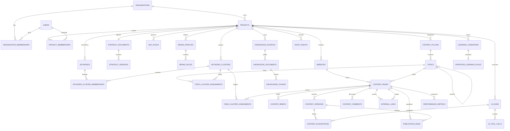

# Database Architecture

## 1. Principles and conventions

PostgreSQL is the source of truth for identities, ownership, workflow state, structured strategy/rules/content, graph relationships, jobs, audits, AI provenance, and performance. pgvector is an extension in the same database. Redis and object storage are supporting systems, not authoritative business stores.

### IDs, names, and time

- Primary keys are application-generated UUIDv4 values. They are opaque API identifiers and avoid coordination across imports/environments. If index locality becomes material, UUIDv7 may replace generation after an ADR; public type remains UUID.
- Tables and columns are `snake_case`, plural table names. Primary/foreign/unique/check/index names use the SQLAlchemy naming convention in `app/db/base.py`.
- `created_at` and `updated_at` are non-null PostgreSQL `timestamptz`, stored as UTC. Business dates keep their source timezone/period separately. Immutable rows omit or never change `updated_at`.
- Every mutable API resource carries an integer `revision` for optimistic concurrency. Immutable version rows use content hashes and parent version references.
- Status/type fields are constrained strings mapped to Python `StrEnum`. PostgreSQL enums are avoided initially because rolling value changes are operationally cumbersome.

### Ownership and tenant isolation

- Global: no tenant key only for controlled reference data (for example a migration ledger).
- Organization-owned: `organization_id NOT NULL` references `organizations`.
- Project-owned: both `organization_id` and `project_id NOT NULL`. This makes every query auditable and supports composite foreign keys preventing a project from another organization.
- Website/page-owned children also retain organization/project keys when they are security/query boundaries. Denormalized tenant keys are protected by composite foreign keys, not trusted application copying.
- Every repository requires a `TenantScope`/principal and includes tenant predicate even when looking up by UUID. A missing resource and foreign-tenant resource both return `404` unless disclosure is explicitly safe.
- Before production, enable PostgreSQL row-level security on tenant tables as defense in depth. A transaction sets trusted `app.organization_id` (and user context where needed) from verified authentication, never from a request body. Table owners do not bypass RLS in application connections. Migrations/admin use a separate controlled role.

### JSONB policy

Use JSONB for structured documents/snapshots, editor JSON, rule parameters, provider payload snapshots, and tool/context manifests. Every long-lived JSON document includes `schema_version`; Pydantic validates writes and explicit upcasters handle old reads. Promote any value needed for ownership, joins, uniqueness, frequent filters/sorts, or referential integrity to a typed column/table. Add GIN/expression indexes only from measured queries.

### Deletion and retention

There is no universal soft-delete flag. User-facing aggregate roots that may be restored use nullable `archived_at`; URLs/unique keys account for archived state through partial indexes. Immutable versions, approvals, audit events, AI/tool provenance, publications, and learning decisions are retained according to policy and cannot be overwritten. Ephemeral caches and eligible source binaries use scheduled hard deletion after retention/hold checks. Organization deletion is an asynchronous, audited erasure workflow; cascading production deletion is never initiated by a casual ORM call.

### Transactions

Application services delimit transactions. Repositories may add/flush but not commit. Required cross-domain projection/events use an outbox row committed with domain changes. External calls occur outside a database transaction; prepare a durable operation first, call the provider, then reconcile result idempotently. Use row locks only around short state transitions, not network calls.

## 2. Entity catalog

Common mutable fields below are `id uuid PK`, `created_at timestamptz`, `updated_at timestamptz`, `revision int`; common project ownership is `organization_id`, `project_id`. `Model` describes the SQLAlchemy concept and lifecycle, not implemented Phase 0 code.

| Entity | Purpose and principal fields | Model, relationships, indexes/constraints, JSONB, ownership |
|---|---|---|
| `organizations` | Tenant root: `name`, `slug`, `status`, `settings`, `archived_at` | Aggregate root; unique active `slug`; status check; JSONB `settings` for bounded tenant preferences. Owns memberships/projects/audit. Self-owned by ID. |
| `users` | Internal identity mapped from OIDC: `identity_issuer`, `identity_subject`, `email`, `display_name`, `status`, `last_seen_at` | Unique `(identity_issuer, identity_subject)`; normalized email index but email is not authorization identity. Global identity; organization access only through memberships. |
| `organization_memberships` | User role in organization: `organization_id`, `user_id`, `role`, `status`, `invited_by_id` | Association; unique `(organization_id,user_id)`; role/status checks; indexes by user and org/status; composite tenant ownership. Project assignments may further narrow access. |
| `project_memberships` | Optional project allowlist/role override: `organization_id`, `project_id`, `user_id`, `role` | Composite FKs ensure same org/project; unique project/user; effective permissions are intersection with org membership. Project-owned. |
| `projects` | Workspace: `organization_id`, `name`, `slug`, `status`, `default_locale`, `default_country`, `settings`, `archived_at` | Org child; unique active `(organization_id,slug)`; indexes org/status; JSONB settings for bounded feature configuration. Organization-owned. |
| `websites` | Site identity: common keys, `base_url`, `normalized_host`, `locale`, `country`, `verification_status`, `verified_at`, `settings` | Project aggregate; unique active `(project_id,normalized_host,locale)`; URL/host checks; indexes project/status. JSONB crawl/presentation settings, not credentials. Project-owned. |
| `strategy_documents` | Stable strategy identity: common keys, `active_version_id`, `status` | One per project initially: unique project; active version deferred FK; status check. Versions are immutable. Project-owned. |
| `strategy_versions` | Exact strategy snapshot: `strategy_document_id`, `version_no`, `schema_version`, `structured_data`, `human_summary`, `status`, `parent_version_id`, `content_hash`, `created_by`, `approved_by/at` | Immutable SQLAlchemy model; unique `(strategy_document_id,version_no)` and content hash as appropriate; one active approved via partial unique index; JSONB `structured_data` validated by versioned Pydantic schema. Project-owned. |
| `brand_profiles` | Stable brand configuration identity: common keys, `active_version_id`, `status` | One active profile per project/locale/channel dimension; versions can be represented by immutable profile snapshot rows or a `brand_profile_versions` supporting table. Project-owned. |
| `brand_rules` | Atomic, version-aware brand rule: common keys, `brand_profile_id`, `rule_key`, `rule_type`, `severity`, `definition`, `source`, `status`, `version_no`, `supersedes_id` | Unique active `(brand_profile_id,rule_key)`; JSONB typed definition (terms, tone, examples, evaluator config); indexes profile/status/type; approval fields. Project-owned. |
| `seo_rules` | Machine-readable SEO rule: common keys, `rule_set_key`, `rule_key`, `category`, `evaluation_type`, `severity`, `definition`, `status`, `version_no`, `supersedes_id` | Deterministic/AI evaluation type check; unique active `(project_id,rule_set_key,rule_key)`; JSONB typed parameters and applicability. Project-owned; active change requires approval. |
| `content_pillars` | Highest content grouping: common keys, `name`, `slug`, `description`, `position`, `status` | Unique active project slug/name; self-independent aggregate; topics child; indexes project/status/position. Project-owned. |
| `topics` | Hierarchical topic: common keys, `pillar_id`, `parent_topic_id`, `name`, `slug`, `description`, `position`, `status` | Composite FKs to same project; unique active slug per project; check not self-parent; service/recursive query prevents cycles. Project-owned. |
| `keyword_clusters` | Versioned semantic/intent group: common keys, `name`, `intent`, `locale`, `country`, `algorithm`, `algorithm_version`, `confidence`, `status`, `parent_cluster_id`, `snapshot_hash` | Index project/intent/status; unique snapshot/id rules; self-parent/cycle checks; cluster membership via supporting `keyword_cluster_memberships`. JSONB may store explanation/evidence, not member IDs. Project-owned. |
| `keywords` | Query inventory: common keys, `keyword`, `normalized_keyword`, `locale`, `country`, `search_volume`, `difficulty`, `cpc`, `intent`, `intent_confidence`, `funnel_stage`, `business_value`, `topic_id`, `parent_keyword_id`, `content_type`, `priority`, `status`, `metrics_as_of`, `source` | Unique active normalized keyword/source or defined merge key per project/locale/country; trigram/search indexes if measured; nonnegative metrics checks; self-parent check. Provider raw snapshot JSONB optional with retention. Project-owned. |
| `keyword_cluster_memberships` | Keyword-to-cluster mapping with provenance: common keys, `cluster_id`, `keyword_id`, `membership_score`, `is_primary`, `evidence` | Unique active keyword/cluster; at most one primary active cluster per keyword/version via partial unique; score 0..1; JSONB evidence/config. Project-owned. |
| `topic_cluster_assignments` | Many-to-many topic/cluster relation: common keys, `topic_id`, `cluster_id`, `relation_type`, `position` | Unique active tuple; composite same-project FKs. Project-owned. |
| `content_pages` | Stable planned/observed page: common keys, `website_id`, `topic_id`, `title`, `slug`, `canonical_url`, `content_type`, `status`, `priority`, `primary_cluster_id`, `current_version_id`, `published_version_id`, `seo_score_cache` | Unique active canonical URL per website; one canonical target per active cluster/site/locale via partial unique; composite FKs; indexes website/status/topic/priority. Score cache is projection, never sole evidence. Project-owned. |
| `page_cluster_assignments` | Page targets primary/supporting cluster: common keys, `page_id`, `cluster_id`, `assignment_type`, `status`, `exception_reason`, `approved_by/at` | Unique active page/cluster; partial unique one canonical page per cluster/site/locale enforced using target identity/model; reviewed exceptions explicit. Feeds `cannibalization_conflicts`. Project-owned. |
| `cannibalization_conflicts` | Reviewable collision: common keys, `cluster_id`, `page_a_id`, `page_b_id`, `reason`, `overlap_score`, `status`, `resolution`, `resolved_by/at` | Canonical page ordering prevents duplicate pair; score check; index unresolved by project/cluster. JSONB evidence/query overlap. Project-owned. |
| `content_briefs` | Immutable/versioned writing contract: common keys, `page_id`, `version_no`, `status`, `schema_version`, `brief_data`, `strategy_version_id`, `seo_rule_version_manifest`, `brand_version_manifest`, `content_hash`, approval fields | Unique page/version; one approved active per page via partial unique; JSONB brief and immutable dependency manifests. Project-owned. |
| `content_versions` | Immutable TipTap snapshot: common tenant keys, `page_id`, `version_no`, `parent_version_id`, `schema_version`, `document_json`, `plain_text`, `content_hash`, `source`, `created_by`, `change_summary` | Unique page/version; hash index; JSONB validated editor document; derived plain text/search vector. No in-place update. Project-owned. |
| `content_suggestions` | AI/human proposed patch: common keys, `page_id`, `base_version_id`, `proposal_type`, `patch`, `rationale`, `source_manifest`, `ai_run_id`, `status`, decision actor/time | Patch/ranges JSONB schema; base hash required; index open page suggestions; status transition constraints. Acceptance produces new `content_version`, never mutates base. Project-owned. |
| `content_comments` | Review comment anchored to document: common keys, `page_id`, `version_id`, `anchor`, `quoted_text`, `body`, `author_id`, `status`, `resolved_by/at` | JSONB typed anchor with node IDs/range; indexes page/status/thread; supporting parent comment ID optional. Project-owned. |
| `internal_links` | Directed planned/approved/observed link: common keys, `source_page_id`, `target_page_id`, `relationship_type`, `anchor_text`, `relevance_score`, `priority`, `status`, `origin`, `evidence`, `observed_at`, `approved_by/at` | Check source != target, scores/ranges; unique active source/target/normalized anchor/origin policy; indexes target/status and source/status; composite same-project FKs. JSONB score components/evidence. Project-owned. |
| `knowledge_sources` | Ingestion root: common keys, `source_type`, `display_name`, `uri`, `object_key`, `status`, `content_hash`, `settings`, `last_ingested_at` | Unique source identity/content hash policy; object key private; JSONB parser/access settings excluding secrets; indexes project/status/type. Project-owned. |
| `knowledge_documents` | Parsed logical document/version: common keys, `source_id`, `external_id`, `title`, `mime_type`, `language`, `content_hash`, `parser_name/version`, `status`, `metadata` | Unique source/external/version hash; JSONB sanitized source metadata; document text may be object-backed according to size. Project-owned. |
| `knowledge_chunks` | Retrieval unit: common keys, `document_id`, `ordinal`, `text`, `token_count`, `content_hash`, `embedding vector(n)`, `embedding_model`, `embedding_version`, `metadata`, `access_label` | Unique document/ordinal/parser version; HNSW/IVFFlat index chosen after data profiling; btree tenant/project/document; GIN full-text for hybrid search. JSONB headings/page/source spans. Project-owned. |
| `ai_runs` | One user/system AI operation: common keys, `actor_user_id`, `purpose`, `provider`, `model`, `prompt_template/version`, `context_manifest`, `status`, `input/output_tokens`, `estimated_cost`, `latency_ms`, `request_hash`, `error_code` | Index project/created/status/purpose; idempotency/request hashes; JSONB context manifest contains source IDs/versions/hashes, not necessarily raw prompt. Project-owned. |
| `ai_tool_calls` | Each requested/executed tool: common keys, `ai_run_id`, `tool_name`, `tool_version`, `permission_level`, `input_redacted`, `output_redacted`, `status`, `approval_id`, `started/finished_at`, `error_code` | Sequence unique within run; indexes run/status/tool; JSONB validated/redacted snapshots and hashes; append-oriented. Project-owned. |
| `approvals` | Human approval bound to exact high-impact operation: common keys, `actor_user_id`, `action`, `resource_type/id`, `operation_digest`, `status`, `expires_at`, `decided_at`, `reason` | Unique active digest/action/resource, expiry/status checks, actor must have current permission at execution too. Organization/project-owned. |
| `learning_candidates` | Proposed pattern from feedback: common keys, `candidate_type`, `scope`, `definition`, `evidence`, `sample_count`, `confidence`, `status`, proposer, reviewer/decision fields | Typed JSONB definition/evidence; confidence/sample checks; index project/status/type. Cannot affect validators until approved. Project-owned. |
| `approved_learning_rules` | Immutable approved promoted rule/version: common keys, `candidate_id`, `target_rule_type/id`, `definition`, `version_no`, `status`, effective/approval fields, `supersedes_id` | Candidate approval unique; JSONB typed definition; one active rule key/scope; activation uses owning brand/SEO service. Project-owned. |
| `publication_destinations` | CMS connection metadata without secret values: common keys, `website_id`, `adapter_type`, `display_name`, `secret_ref`, `settings`, `status` | Unique destination name/site; JSONB non-secret adapter settings; secret manager reference only. Project-owned. |
| `publication_runs` | Audited draft/publish attempt: common keys, `destination_id`, `page_id`, `content_version_id`, `action`, `approval_id`, `idempotency_key`, `status`, `external_id/url`, `request/response_hash`, timestamps/error | Unique destination/idempotency key; exact immutable version and approval; indexes status/date/page. Sanitized response metadata JSONB optional. Project-owned. |
| `performance_metrics` | Normalized page/query/channel measure: common tenant keys, `website_id`, `page_id`, `metric_date`, `dimension_type`, `dimension_key`, `metric_name`, `value`, `source`, `import_run_id` | Unique source/site/page/date/dimensions/metric; time/date and page indexes; numeric constraints. Optional JSONB source dimensions only if not query-critical. Project-owned. |
| `job_runs` | Durable async work state: common keys, `job_type`, `payload_ref`, `operation_key`, `status`, `attempt`, `max_attempts`, `progress`, `heartbeat_at`, `result_ref`, `error_code` | Unique operation key per scope; status/attempt checks; indexes queue/status/heartbeat. JSONB small validated refs/progress, not large payloads. Organization/project-owned. |
| `outbox_events` | Transactional domain event awaiting dispatch: `aggregate_type/id`, `event_type/version`, `payload`, `occurred_at`, `published_at`, attempts | Insert-only with aggregate transaction; unpublished index; JSONB versioned minimal payload. Copies tenant/project keys. |
| `audit_events` | Immutable security/business trail: `organization_id`, optional project/actor, `action`, `resource_type/id`, `outcome`, `request_id`, `ip_hash`, `user_agent_hash`, `before/after_hash`, `metadata`, `occurred_at` | Append-only, time-partition later; indexes org/time, resource, actor; JSONB redacted metadata. Organization-owned; retention/hold controlled. |

Supporting version tables for brand profiles, SEO rule sets, linking guides, and content-map snapshots should follow the stable identity + immutable versions pattern when implemented. The catalog lists required conceptual entities from the brief and adds memberships, approvals, job/outbox/audit records needed to make security and asynchronous behavior concrete.

## 3. Relationship diagram

## 4. Strategy API schemas

The future Pydantic boundary separates ORM and transport:

- `StrategyCreateRequest`: structured `business`, audiences, personas, goals, competitors, products/services, markets, SEO/content goals; rejects unknown fields for its schema version.
- `StrategyDraftResponse`: identity, version, status, structured document, human summary, dependency/provenance metadata, revision.
- `StrategyUpdateRequest`: complete replacement or explicit JSON Patch against `base_version_id`; never ambiguous partial nested merge.
- `StrategyApproveRequest`: exact version ID and optional decision note.
- `StrategyResponse`: transport types only with `from_attributes` mapping in a dedicated mapper, never direct ORM serialization.

Breaking structural changes increment `schema_version`, add an upcaster, update JSON fixtures, and preserve old immutable versions. Business approval version and JSON schema version are independent.

## 5. Index and query review

Every migration identifies expected query patterns and verifies `EXPLAIN (ANALYZE, BUFFERS)` against representative volume before adding non-obvious indexes. Default tenant indexes begin with `organization_id` and often `project_id`, followed by status/sort key. Cursor pagination needs a stable composite order such as `(created_at DESC, id DESC)`. Partial indexes cover active/approved rows. Vector index type/parameters are selected only after corpus size and recall/latency benchmarks; filtered tenant/project retrieval must be evaluated to avoid broad cross-tenant vector scans.

## 6. Migration policy

- Every schema change is an Alembic revision with descriptive slug and reviewed generated SQL.
- CI tests upgrade from empty, upgrade from supported previous snapshot, downgrade when safe, and model/schema drift.
- Data backfills are resumable, observable, tenant-batched jobs; migrations should not hold long transactions for large data.
- Add columns nullable/default-free first where needed, deploy compatible code, backfill, validate, then add constraints. Remove only after all readers stop using the field.
- Destructive changes need explicit database owner review, restore evidence, retention assessment, and forward/rollback procedure.
- pgvector and required PostgreSQL extensions are enabled in a controlled baseline migration with deployment compatibility verified.

