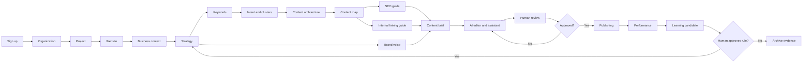

# Product Requirements Document

Status: Phase 0 approved blueprint  
Audience: product, engineering, design, security, and future implementation agents

## 1. Product definition

The SEO Content Intelligence & AI Content Operating System converts business goals into a governed, measurable content system. Its differentiator is a structured chain of evidence and decisions:

```text
business context -> strategy -> keyword/intent model -> content architecture
-> content and linking rules -> brief -> governed AI/human editing -> publication
-> performance -> approved learning -> strategy improvement
```

The database is canonical. Strategy, brand, rules, editor content, links, and learning must exist as typed entities and relationships; human documents and graph/editor views are projections. The product may use maintouch.com/platform/content-agent as category inspiration only. No proprietary prompts, implementation, UI, or private behavior are to be copied.

## 2. Users and outcomes

| Persona | Primary outcome | Typical decisions |
|---|---|---|
| Organization admin | Safe setup, people, access, integrations | membership, policy, billing/limits later |
| SEO manager | Defensible strategy and search architecture | intent, clusters, targets, rules, priorities |
| Content manager | Predictable production portfolio | briefs, assignments, status, quality gates |
| Writer | Faster grounded drafts without losing control | outline, rewrite proposal, evidence, link suggestions |
| Editor | Consistent publishable output | accept/reject patches, comments, approval |
| Viewer/stakeholder | Transparent progress and performance | read strategy, map, content, reports |

## 3. Goals, non-goals, and measures

### Goals

- Maintain one traceable system from strategy to page and performance.
- Prevent the common `one keyword = one page` failure by mapping intent-aligned clusters to target pages.
- Make SEO, brand, and linking policy machine-readable and testable.
- Keep all AI activity scoped, source-attributed, permissioned, auditable, and reversible.
- Let a backend/AI developer and a frontend/UX developer work in parallel through stable HTTP contracts.

### Phase 0 non-goals

No production behavior is implemented: no strategy generation, keyword classification or clustering, content-map UI, editor, orchestration, link recommendation, knowledge ingestion, publishing, analytics, or learning. Phase 0 also excludes billing, a custom identity service, mobile apps, microservices, Neo4j, and external vector stores.

### Product measures (baselines set during pilots)

- setup: time to first approved strategy and first approved content map;
- architecture: percentage of active target pages backed by one approved keyword cluster, cannibalization conflicts unresolved, and orphan-page rate;
- production: brief-to-approval lead time, human acceptance rate of AI proposals, and revision count;
- quality: deterministic SEO pass rate, editor override rate, and grounded-citation rate for knowledge-backed output;
- outcome: indexed pages, qualified organic traffic/conversions, query coverage, and refresh uplift;
- safety/reliability: cross-tenant access incidents (target zero), unauthorized tool executions (zero), job failure rate, and publication rollback rate.

Measures are diagnostic, not automatic rule-changing signals.

## 4. End-to-end product flow



Every transition records actor, source version, result version, timestamp, and decision where applicable.

## 5. Capability specifications

`Owner` is the backend domain that owns writes and invariants. API paths are representative v1 resources; exact contracts are in [API.md](API.md). All endpoints require authentication and tenant authorization unless explicitly public.

| # / capability | Responsibility | Inputs -> outputs | Owner / dependencies | APIs | Future extension points |
|---|---|---|---|---|---|
| 1 Project Management | Tenant-scoped workspace, lifecycle, settings | org membership, name, locale, goals -> project | `projects`; organization/membership | `/projects`, `/projects/{id}` | templates, quotas, billing |
| 2 Website Management | Sites, domains, crawl/publish connection metadata | project, canonical URL, locale -> website and verified status | `websites`; projects, integrations | `/projects/{id}/websites` | multi-domain, staging sites |
| 3 Strategy | Versioned structured business/SEO/content direction plus document projection | business, market, products, audience, goals, competitors -> draft/approved strategy version | `strategy`; projects, websites | `/projects/{id}/strategy`, `/strategy/{id}/versions` | simulations, scenario branches |
| 4 Brand Voice | Typed voice profile, examples, and enforceable brand rules | attributes, terms, samples, audiences -> versioned profile/rules | `brand`; strategy, knowledge | `/projects/{id}/brand-profile`, `/brand-rules` | locale profiles, channel variants |
| 5 SEO Guide | Versioned deterministic and AI-evaluated rule sets | goals, locale, site constraints -> active/draft SEO rule set | `seo`; strategy, websites | `/projects/{id}/seo-rules` | industry packs, experiment variants |
| 6 Keyword Intelligence | Imported/enriched keyword inventory with provenance | query, volume, difficulty, CPC, source -> normalized keyword | `keywords`; projects, integrations | `/projects/{id}/keywords`, `/keyword-imports` | provider adapters, trend series |
| 7 Keyword Clustering | Group semantically/intent-equivalent queries; never equate keyword with page | keyword set, locale, model/config -> versioned cluster proposal | `keywords`; AI, jobs | `/projects/{id}/keyword-cluster-jobs`, `/keyword-clusters` | alternative cluster algorithms, confidence calibration |
| 8 Search Intent | Classify intent with confidence and human override | query, SERP evidence, taxonomy -> intent assessment | `keywords`; integrations, AI | `/keywords/{id}/intent`, bulk job | custom taxonomies, SERP drift alerts |
| 9 Content Pillars | Top-level content architecture aligned to strategy | approved strategy, topics -> pillars | `content`; strategy | `/projects/{id}/pillars` | locale/site-specific variants |
| 10 Topic Clusters | Connect pillars, topics, and keyword clusters | pillar, semantic themes, cluster IDs -> topic hierarchy | `content`; keywords | `/pillars/{id}/topics`, `/topics/{id}/clusters` | multiple hierarchy views |
| 11 Content Map | Query and mutate graph projection of pillars/topics/clusters/pages | entities, relations, filters -> graph nodes/edges | `content_map`; content, keywords, linking | `/projects/{id}/content-map` | collaborative layout, snapshots |
| 12 Internal Linking Guide | Store rules governing eligible links, anchors, priorities | strategy, site structure, SEO policies -> rule set | `internal_linking`; SEO, content | `/projects/{id}/linking-rules` | rule packs, experiments |
| 13 Internal Link Graph | Canonical proposed/approved/observed page links | pages, relation, anchor, evidence -> versioned link edge | `internal_linking`; content, crawls | `/pages/{id}/internal-links`, `/link-opportunities` | decay/flow models, crawl reconciliation |
| 14 Content Brief | Freeze target, intent, coverage, sources, links, and acceptance rules for a page version | page, cluster, rules, strategy -> brief | `content`; strategy, keywords, SEO, linking, brand | `/pages/{id}/briefs` | brief templates, assignments |
| 15 AI Content Editor | Structured TipTap document editing, autosave, versions, comments, AI patches | document JSON, selection, command -> autosave/version/proposal | `content`; AI, SEO, brand | `/pages/{id}/document`, `/versions`, `/suggestions` | real-time collaboration, richer nodes |
| 16 AI Assistant | Conversational help scoped to current project/document | user request, approved context kinds -> grounded answer or tool proposal | `ai`; context manager, tools | `/ai/chat`, stream endpoint | multimodal inputs, reusable workflows |
| 17 AI Orchestrator | Bounded plan/execute loop over authorized typed tools | request, principal, task context -> audited run and proposals | `ai`; tools, security | `/ai/runs`, `/ai/chat` | durable resumable workflows |
| 18 AI Tool Registry | Discover/version tool contracts and enforce permissions | descriptor, schemas, executor -> registered tool/version | `ai`; all public domain services | internal registry; `/ai/tools` admin/read | plugin-style domain tools, policy engine |
| 19 Knowledge Base | Tenant-isolated ingestion and retrieval with provenance | website/PDF/DOCX/docs -> source, chunks, embeddings | `knowledge`; storage, jobs, AI | `/projects/{id}/knowledge-sources`, `/knowledge/search` | connectors, hybrid/reranking models |
| 20 SEO Validator | Reproducible checks plus separately labeled AI assessments | content version, rule-set version -> findings and score components | `seo`; content, rules, AI | `/seo/analyses`, `/pages/{id}/seo-analyses` | rendered-page and SERP checks |
| 21 Brand Validator | Evaluate content against active profile/rules with evidence | content version, brand version -> deterministic/AI findings | `brand`; content, AI | `/brand/analyses` | audience/channel-specific validation |
| 22 Content Quality Engine | Aggregate quality evidence without hiding components | SEO, brand, factuality, readability results -> quality report | `content`; SEO, brand, knowledge | `/pages/{id}/quality-reports` | configurable scorecards, benchmarks |
| 23 Version History | Immutable content/strategy/rule versions and compare/restore-as-new | entity snapshot, actor, reason -> version/hash/diff | owning domain; audit | `/{resource}/{id}/versions`, compare | branch/merge, legal retention |
| 24 Human Feedback | Capture accept/reject/edit/rating with context | proposal, before/after, reason -> feedback event | `learning`; AI, content, audit | `/ai/proposals/{id}/decision`, `/feedback` | reviewer calibration, annotations |
| 25 Learning Engine | Convert repeated edits into reviewable candidate rules | feedback/diffs, evidence threshold -> candidate; approval -> active rule version | `learning`; brand, SEO, AI | `/learning/candidates`, `/learning/{id}/approve` | offline evaluation, per-team patterns |
| 26 Publishing | Map an approved immutable version to CMS draft/publish action | approval, page version, target -> publication run/status | `publishing`; content, integrations, security | `/publication-runs` | more CMS adapters, scheduled releases |
| 27 Performance Intelligence | Normalize page/query metrics and identify opportunities | Search Console/analytics imports -> metrics, refresh candidates | `analytics`; websites, content, jobs | `/performance/imports`, `/pages/{id}/performance` | attribution, forecasting, experiments |
| 28 Analytics | Tenant-safe dashboards and operational/product reporting | metrics, content/link/AI events -> aggregates and views | `analytics`; all read models | `/projects/{id}/analytics` | warehouse export, custom reports |

## 6. Core domain rules

### Strategy

The editable structure contains `business`, `audience[]`, `personas[]`, `goals[]`, `competitors[]`, `products[]`, `services[]`, `markets[]`, `seo_goals[]`, and `content_goals[]`. A `strategy_document` is a stable identity; immutable versions contain the JSON snapshot, schema version, human summary, status, author, timestamps, and content hash. Only one approved active version exists per project. Updates use optimistic concurrency and create a new draft version; approval is explicit. Normalized child records are introduced only when a field needs independent identity, joins, permissions, or lifecycle.

### Keywords and cannibalization

Each keyword stores normalized query, locale/country, metrics with source/timestamp, intent/confidence, funnel stage, business value, topic/cluster, parent, proposed target, content type, priority, and status. The mapping is:

```text
many keywords -> one intent-coherent cluster -> one canonical target page
one page -> one primary cluster + optional supporting clusters
```

A project/locale may have only one active canonical page for a cluster. Assignments with overlapping normalized query sets or high semantic overlap create a `cannibalization_conflict`, never a silent second target. Resolution options are merge cluster, merge/redirect page, distinguish intent, mark supporting page, or explicit reviewed exception. Re-run checks on assignment, content-map approval, crawl import, and URL change.

### Content architecture

```text
ContentPillar 1 -> many Topic
Topic many <-> many KeywordCluster (through typed assignment)
KeywordCluster 1 -> zero/one canonical ContentPage per locale/site
ContentPage many <-> many related ContentPage (typed graph edge)
```

A page remains independently addressable while its placement can change. Hierarchy edges cannot form cycles. Page target assignments and internal links are separate relationships.

### Content editor

Canonical content is validated TipTap/ProseMirror JSON with a pinned document schema version. Rendered HTML, plain text, and search excerpts are derived. The client autosaves debounced operations with `base_version_id` and an idempotency key; the server rejects stale bases with `409 VERSION_CONFLICT`. Named versions are immutable snapshots. AI returns a proposed, range-anchored patch with base hash, rationale, sources, rule versions, and model provenance. A user accepts/rejects each proposal; accepting creates a new document version. Comments anchor to durable node IDs and retain fallback quoted text when edits orphan a range.

### Version and status model

Mutable resources expose a stable identity and immutable versions. Typical lifecycle is `draft -> in_review -> approved -> active/ready -> archived`; invalid transitions return `409`. Published content references the exact approved version. Restoring creates a new version rather than mutating history.

## 7. Role and permission matrix

`R` read, `W` create/edit, `A` approve/activate, `P` publish/manage high-impact operation, `M` membership/admin. Project assignments may narrow an organization role; effective permission is the intersection.

| Capability | Admin | SEO Manager | Content Manager | Writer | Editor | Viewer |
|---|---:|---:|---:|---:|---:|---:|
| Organization/members | M | - | - | - | - | - |
| Project/site settings | W | R/W | R | R | R | R |
| Strategy | R/W/A | R/W/A | R | R | R | R |
| Keywords/clusters/map | R/W/A | R/W/A | R/W | R | R | R |
| SEO/link/brand rules | R/W/A | R/W/A | R/W | R | R | R |
| Briefs | R/W/A | R/W/A | R/W/A | R/W | R/W | R |
| Content/editor | R/W/A | R/W | R/W/A | R/W | R/W/A | R |
| AI read tools | R | R | R | R | R | R |
| AI proposal tools | R/W | R/W | R/W | R/W | R/W | - |
| Learning approval | A | A | A | - | A | - |
| Publish/connectors | P | - | P | - | P | - |
| Analytics/audit | R | R | R | R | R | R |

Exact permission strings (for example `strategy.approve`) are enforced server-side; UI visibility is only a convenience.

## 8. MVP and V1 boundaries

### MVP

Organization/project/site foundations; structured strategy; keyword import, intent and clustering; pillars/topics/target assignments; visual content map; versioned SEO guide and deterministic validator; linking guide and governed recommendations; briefs; TipTap editor; basic scoped AI assistant; approval/version history; minimum audit and observability.

MVP exit requires one organization to move imported keywords through an approved content map into a brief and approved document while tenant, version, rule, and AI provenance remain traceable.

### V1

Adds richer orchestration, knowledge ingestion/retrieval, brand validation, approved learning, CMS publishing, Search Console/performance imports, collaboration, evaluation/quality hardening, quotas, and production operations. V1 does not imply autonomous publishing or autonomous rule changes.

## 9. Acceptance principles

Every implemented capability must specify input schema, authorization, processing/service boundary, transaction, stored output and provenance, API contract, deterministic versus AI validation, approval point, observability, tests, and rollback/recovery. A UI-only document, unversioned prompt, opaque composite score, or vendor-coupled model call does not satisfy the product requirement.

