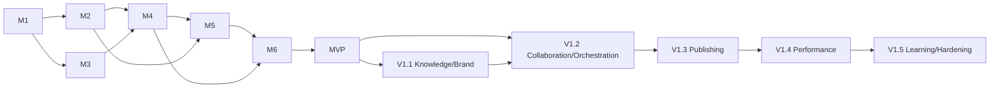

# Delivery Roadmap

## 1. Planning assumptions

Two developers work in parallel: Developer 1 owns Python/backend/database/AI/algorithms/integrations; Developer 2 owns Next.js/React/API client/React Flow/TipTap/UX. Estimates are relative milestones, not calendar commitments. Each milestone is a demonstrable vertical slice with tenant/security/audit/test foundations included, not deferred to a final hardening sprint.

Phase 0 is architecture only. MVP contains strategy, keywords/clustering, content architecture/map, SEO guide/validator, internal linking, briefs, editor, and basic assistant. V1 adds richer orchestration, knowledge, brand, learning, publishing, performance, collaboration, and production hardening.

## 2. Phase 0 — blueprint (complete in this repository)

Deliverables: PRD; system/backend/frontend/data/API/AI/editor/graph/link/security/testing architectures; repository/config/contracts; AGENTS/Codex workflow; 10 ADRs; MVP/V1 plan; risks/assumptions/open questions; developer split. Acceptance is checked in [PHASE-0-REPORT.md](PHASE-0-REPORT.md). No product feature behavior.

## 3. MVP milestones

### M1 — secure project foundation

Backend: application factory/health, settings wiring, first Alembic baseline/extensions, organizations/users/memberships/projects/websites, OIDC adapter, principal/RBAC, tenant repositories and RLS, response/errors/cursors/idempotency/audit/outbox, CI/local infrastructure. Frontend: app shell/session, organization/project/site flows, generated API client, permission/error primitives, design tokens. Joint: cross-tenant E2E and OpenAPI pipeline.

Exit: two organizations cannot access each other through API/repository/RLS; an authorized user creates project/site; audit and contract tests pass; restore/migration path is exercised.

### M2 — structured strategy and rule foundations

Backend: strategy identity/immutable versions/approval; SEO rule definition/lifecycle; deterministic evaluator registry skeleton with real title/meta/H1/canonical checks. Frontend: strategy structured form + human projection/version review; SEO guide rule UI/results. Joint: version conflict and approval E2E.

Exit: user creates/edits/approves exact structured strategy and rule versions; old versions reproducible; deterministic results cite exact rule/content versions.

### M3 — keywords, intent, and clustering

Backend: import mapping/jobs, metrics provenance, intent taxonomy/override, cluster algorithm interface and first evaluated implementation, target assignment/conflict detection. Frontend: import mapping/progress, keyword table/filter/bulk review, cluster review/cannibalization resolution. Joint: representative dataset and algorithm evaluation report.

Exit: an import produces reviewable clusters and intent with provenance; user resolves conflicts; no `keyword = page` assumption; rerun is idempotent/versioned.

### M4 — content architecture and map

Backend: pillars/topics/pages/assignments, graph projection/revision/commands, recursive/cycle constraints, link-degree projection. Frontend: React Flow plus accessible tree/table, node details, filters, explicit graph commands, separate saved layout, conflict rollback. Joint: large filtered graph performance and keyboard E2E.

Exit: user builds `pillar -> topic -> cluster -> page`, cannot create cycle/cross-tenant edge/duplicate canonical target, and visual/tabular views agree.

### M5 — briefs, editor, versions, validation (complete in [PHASE-5.md](PHASE-5.md))

Backend: dependency-frozen briefs, TipTap/block schema validation, autosave/version/comment/suggestion APIs, deterministic SEO expansion and quality report. Frontend: structured block editor canvas, autosave/conflict, history/compare/restore, SEO findings, suggestion diff/decision. Joint: sanitized render, anti-injection prompt fencing, and concurrent edit E2E.

Exit: approved brief leads to structured versioned document; stale saves do not overwrite; findings are reproducible; suggestion application creates a new version. All exit criteria verified in [PHASE-5.md](PHASE-5.md).

### M6 — internal linking and basic AI assistant

Backend: linking guide/edge lifecycle, candidate features/scoring/evaluation, anchor proposals, provider adapter baseline, bounded context manager, governed read/propose tool subset, AI runs/cost/audit. Frontend: opportunities/evidence/components, link/editor proposals, assistant panel, sources/tool/proposal status and usage errors. Joint: injection/tenant/tool/acceptance evaluation.

Exit: user obtains relevant explainable link and content proposals, explicitly accepts/rejects them, no model mutation bypass exists, and MVP end-to-end flow passes.

### MVP release gate

Security threat review/RLS, performance SLO baseline, accessibility AA critical flows, backup restore, migration rehearsal, provider cost/quality thresholds, observability/alerts/runbooks, browser/API E2E, and pilot acceptance. Production can omit publishing; approved content may be exported manually.

## 4. V1 milestones

### V1.1 — knowledge and brand

Secure upload/storage, parser/chunker/embedding pipeline, hybrid retrieval/reranking/evals/deletion; versioned brand profile/rules and brand validator; citations in assistant/editor. Exit: supported PDF/DOCX/web/product sources are isolated, attributable, revocable, and improve groundedness against baseline.

### V1.2 — orchestrated workflows and collaboration

Expanded typed tool catalog, resumable/bounded AI runs, approval inbox; assignments/mentions/notifications, stronger comments and optional real-time editing after conflict model decision. Exit: multi-step proposal workflow survives retry/cancel and never crosses approval/tenant boundaries.

### V1.3 — publishing

Destination model/secret manager, first CMS adapter sandbox, transformation/preview, exact version approvals, idempotent draft/publish/reconciliation/rollback guidance. Exit: authorized editor publishes a reviewed immutable version to sandbox/production with traceable external state and unknown-result recovery.

### V1.4 — performance intelligence

Search Console/analytics import adapters, metric normalization/freshness, dashboards, page/query opportunity and refresh candidates, no automatic policy change. Exit: a published page maps to source metrics and yields evidence-backed review candidates.

### V1.5 — approved learning and production hardening

Diff/feedback pattern extraction, candidate evidence, holdout evaluation, human approval/versioned activation; quotas/billing hooks if required, privacy/retention/export/erasure, SLO/capacity/DR, security test/remediation, admin/audit operations. Exit: approved rule improvement is reversible/evaluated/audited and production readiness gate is signed off.

## 5. Dependency and parallel plan

Within a milestone, Developer 1 lands schemas/examples/mock fixtures early; Developer 2 builds UI against committed OpenAPI. They integrate one vertical path before filling breadth. Both review permissions, editor/map commands, and approval contracts.

## 6. Definition of milestone done

Outcome demonstrated; role/tenant/version invariants and failure paths pass; database migration/rollback and API/tool contracts reviewed; OpenAPI/types synchronized; jobs idempotent/observable; UI accessible and handles conflicts; audit/metrics/alerts exist; relevant docs/ADR/current roadmap updated; no fake integration or deferred critical security; known risks owned with follow-up milestone.

## 7. Deliberately deferred

Microservices, Neo4j, external vector database, autonomous publishing/rule changes, general-purpose agent/database tools, many CMS/keyword vendors, custom identity/passwords, advanced billing, native mobile, and data warehouse are deferred until measured requirements and accepted decisions justify them.

