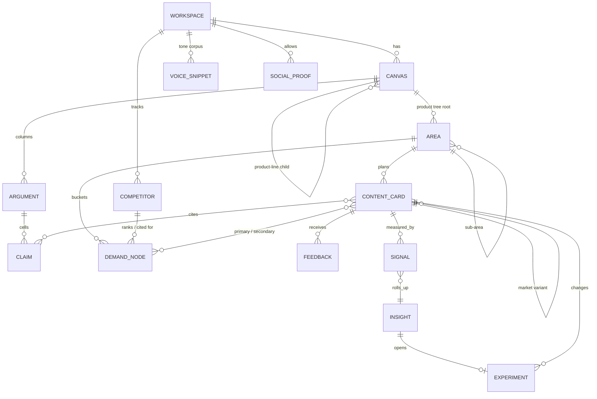

# SEO/GEO Content System — Developer Handoff v3

**Version:** 3.0 · 17 September 2026 (supersedes v2 of the same date)
**Author:** Anirudh (product owner)
**Status:** Product architecture agreed after critique round; ready for technical design and estimation

---

## 0. What changed from v2

| Area | v2 | v3 |
|---|---|---|
| Operating model | Product for B2B SaaS marketing teams | Consultative service first, run on the product; self-serve later (§1.3) |
| Pitch | Implicit | "You control how AI perceives you" — claim-constrained content is the feature (§1) |
| Existing content | Not covered | Site import creates cards for every live page; GSC connected at import (§4.6) |
| Publishing | Non-goal | `publish` verb over MCP / Claude Code writes `cms_id`; direct CMS API later (§6.6) |
| Search Console | Phase 2 | Phase 1, at import; CTR/rank detector runs on day one (§4.6, §7) |
| Scoring | volume + closeness + gap | volume + competitor gap + funnel weight; closeness removed (§4.5) |
| QA hard fail #1 | "Every factual claim maps to a CLAIM" | Only assertions about the tenant, its products, clients and competitors must map; category information is sourced or general, soft flag (§6.4) |
| Claim matching | Extraction from prose | Writer cites claim IDs inline; QA verifies IDs and hunts unmarked brand assertions (§6.3, §6.4) |
| Claim versioning | Stored | Acted on: stale detection, insight, section regenerate (§6.7) |
| Gates | Always human | `auto_approve` config per gate and kind (§5.4) |
| GEO | Type flag | Prompt-primary cards: own scoring, outline template, QA checks; dual-primary cards (§4.7) |
| Markets | Monolingual | `market` on cards; variant groups = hreflang sets; per-market overrides (§5.5) |
| Traceability | Internal | Three visible artefacts: perception report, claim coverage map, provenance export (§7.6) |
| Prompt architecture | Unspecified | Bundle order and five model calls specified (§6.8) |
| Board | Six columns | Backlog added as column and state; Review column shows the gate; Live set by `publish` or manual URL (§5.1) |
| Elevator pitch | Generated, unapproved | A claim cell (row `pitch`), approved like any other (§4.1) |

---

## 1. What this is

A multi-tenant product that turns a positioning canvas plus keyword and prompt lists into a ranked content plan, produces human-gated pillar pages, cluster posts and refreshes written only against approved positioning claims, publishes them, and learns from search, AI-visibility, CRM and call data to propose improvements a human applies.

The pitch: **you control how AI perceives you.** Every sentence a page asserts about the company traces to a claim someone approved. What search engines and AI answers say about the brand is what the brand decided to say.

The product is organised as **four modules the user sees** plus a **workspace base**. The backend is one API that the web UI, a CLI and an MCP server all call.

### 1.1 Non-goals for v1

- Running positioning workshops. The canvas is produced with the client and entered into the product.
- Live API pulls from Ahrefs, Semrush or Otterly. Demand data arrives as CSV; the ingest boundary is where APIs plug in later. Search Console is the exception and connects at import.
- Autonomous edits to live content. The Iteration Lab only proposes.
- A native crawler beyond what site import needs (sitemap, titles, headings, links). Full technical crawl is phase 3.

### 1.2 Design principles

1. **Flat views, linked data.** Each tab is a plain table, board or document. Relationships surface as tags, chips or dropdowns. One optional read-only map shows the whole graph.
2. **One travelling object.** A content card is created in Strategy, prioritised in the Content Hub, worked in Production, measured in the Iteration Lab. Its state machine is the Kanban.
3. **Traceability, visible.** Every published page traces to approved canvas cells, a kept demand node and an area. Every later edit traces to an accepted insight. The trace is exported, not just stored.
4. **Humans decide at fixed gates, machines redo downstream work.** Gates are yes/no on lists or documents. Gates can be delegated to the machine per tenant once trust is earned (§5.4).
5. **Config over code.** Any rule that would be wrong for another company is tenant config.
6. **API-first.** Every button is a job; CLI and MCP expose the same jobs.
7. **The site you already have is in the graph.** Existing pages are cards. Nothing is planned, written or measured without them.

### 1.3 Operating model — service first

Phase 1 is delivered as a consultative engagement run on the product: the consultant builds the canvas with the client, imports the site, runs the pipeline and reviews at the gates; the client sees the board, the writer view and the reports. Self-serve onboarding is deferred until the product has run three clients in unrelated categories.

This changes the acceptance test: **a second client can be taken from canvas to a published page in under one working day of consultant time.**

---

## 2. Product map

```
┌──────────────────────┐   ┌──────────────────────┐
│ Strategy             │──▶│ Content Hub          │
│ Canvas · Demand ·    │   │ Plan board ·         │
│ Brand kit · Map      │   │ Dashboard            │
└──────────────────────┘   └──────────┬───────────┘
          ▲                            ▼
┌──────────────────────┐   ┌──────────────────────┐
│ Iteration Lab        │◀──│ Production           │
│ Digest · Experiments │   │ Writer view ·        │
│ · History · Reports  │   │ Publish · CLI · MCP  │
└──────────────────────┘   └──────────────────────┘
┌────────────────────────────────────────────────┐
│ Technical SEO (own module, phase 2)            │
├────────────────────────────────────────────────┤
│ Workspace base: site import · integrations ·   │
│ config · reviewers · billing · API keys        │
└────────────────────────────────────────────────┘
```

| Module | Verb | Phase |
|---|---|---|
| Strategy | authored | 1 |
| Content Hub | planned | 1 |
| Production | executed, published | 1 |
| Iteration Lab | learned | 1 (CTR/rank on imported pages), 2 (full numeric), 3 (voice) |
| Technical SEO | audited | 2 |
| Workspace base | configured | 1 |

---

## 3. Data model — the strategy graph

All entities carry `workspace_id`.



### 3.1 Entities

| Entity | Purpose | Key fields |
|---|---|---|
| `WORKSPACE` | Tenant root | `name`, `domain`, `config` (JSON, §9), `integrations` (JSON) |
| `CANVAS` | One Fletch canvas | `parent_id` (null = company), `product_line`, anchors `company` / `persona` / `use_case` / `alternative` / `category` (each `{text, primary}`), `problem_summary`, `differentiation_summary`, `version` |
| `ARGUMENT` | One column | `canvas_id`, `order`, `sub_problem`, `differentiation_pillar`, `capability`, `features[]`, `benefit`, `inherited_from`, `override` |
| `CLAIM` | One approved cell, addressable | `argument_id` (nullable for canvas-level rows), `row` (`sub_problem` / `pillar` / `capability` / `feature` / `benefit` / `problem_summary` / `differentiation_summary` / **`pitch`**), `text`, `evidence`, `approved`, `approved_by`, `version`, `superseded_by`, `market_overrides` (JSON, §5.5) |
| `AREA` | Node of the product tree | `canvas_id`, `parent_id`, `name`, `default_argument_id` |
| `COMPETITOR` | Named competitor | `name`, `domain`, `area_ids[]`, `stance` |
| `DEMAND_NODE` | Keyword or prompt | `type` (`keyword` / `prompt`), `text`, `variants[]`, `volume`, `country`, `area_id`, `argument_id`, `funnel`, `intent`, `competitor_ids[]`, `status`, `discard_reason`, `score`, `score_breakdown`, **`origin`** (`upload` / `gsc_striking_distance` / `insight`), **`citation_gap`** (prompts), **`platforms[]`** (prompts) |
| `CONTENT_CARD` | The travelling object | `kind` (`pillar` / `cluster` / `compare` / **`refresh`**), `area_id`, `argument_id`, **`market`** (`{lang, country}`), **`variant_of`** (nullable), `primary_demand_id`, **`primary_prompt_id`** (nullable — dual primary), `secondary_demand_ids[]`, `state` (§5.2), `owner`, `due`, `priority`, `outline`, `draft` (versioned), `bundle_ref`, `qa_report`, **`url`**, `cms_id`, **`published_at`**, **`stale_claims[]`**, `word_budget`, **`origin`** (`plan` / `import` / `insight` / `manual`) |
| `VOICE_SNIPPET` | Tone corpus item | as v2 |
| `SOCIAL_PROOF` | Allowed proof | `type`, `name`, `asset_ref`, `area_ids[]`, **`markets[]`**, `approved` |
| `FEEDBACK` | Typed gate comment | as v2, plus `source` (`gate` / `section_comment`) — section comments are feedback too |
| `SIGNAL` | One measurement | `target_type` + `target_id`, `source` (`gsc` / `ahrefs` / `otterly` / `crm` / `call` / `crawl`), `metric`, `value`, `period`, `raw_ref` |
| `INSIGHT` | Detector output | as v2; detectors now include `stale_claim` and `striking_distance` |
| `EXPERIMENT` | Applied insight under measurement | as v2 |
| `JOB_RUN` | Audit | as v2, plus `prompt_version` is mandatory for every model call |

### 3.2 Why these choices

- **Claims are canvas cells; the pitch is one too.** Nothing enters a bundle that was not approved, including line one.
- **Imported pages are cards.** Siblings, cannibalisation, internal links, Technical SEO and the Iteration Lab all work against the whole site from day one. `origin: import` distinguishes them.
- **Market is on the card, not the workspace.** A page and its translations are a variant group; the group is the hreflang set.
- **Prompts get their own fields.** No volume, so they are scored on `citation_gap × platforms`, not on a normalised zero.
- **Section comments are feedback.** The most specific writer feedback in the product now reaches the Iteration Lab.

---

## 4. Strategy module

Three flat tabs and one optional map. Selecting a row in any tab is a filter, not a navigation.

### 4.1 Canvas tab

- Renders the Fletch canvas as in the reference: five anchors, problem summary, arguments as columns (sub-problem / pillar / capability / features / benefit), differentiation summary. "+ column" adds an argument.
- Dropdown at top: company canvas (default) or a product-line canvas. Inherited cells carry "from company"; overridden cells carry "overridden".
- Each cell shows `approved` state and an evidence icon.
- **The elevator pitch is a cell.** Generated once from anchors + summaries as a draft, then approved like any other claim (`row: pitch`). It is line one of every writer bundle only when approved.
- Anchors marked primary must each pass the stands-on-its-own rule; the UI enforces at least one primary anchor.
- **Changing an approved cell creates a new claim version and triggers the stale-claim job (§6.7).** The UI shows "N live pages cite this" before confirming.

### 4.2 Demand tab

- Flat, filterable, sortable table: text, type, volume, country, area, argument, funnel, intent, competitor, status, score, origin.
- **Default view is the review queue**: `status = discarded` sorted by confidence ascending, with a "needs a call" filter at confidence < 0.65. The full table is one filter away.
- Group-by area is a toggle, off by default.
- Upload button opens the CSV mapping dialog. Uploads stored raw.
- Bulk actions: keep / discard / reassign area / set argument. This is H1. A re-admitted row shows `pending classify` until the pipeline re-runs it.

### 4.3 Brand kit tab

Two sections:
- **Tone**: rules (spelling, banned words, style), example passages, voice corpus with source and date, tone profile with `provisional` flag.
- **Social proof**: logos, case studies, quotes, stats — each with approval, the areas and **the markets** it may appear in.

Competitor edge is the Alternative anchor on the canvas plus stances in Workspace config. *Open question 8 asks whether stances should move onto the canvas.*

### 4.4 Map (optional, read-only)

Company canvas → product-line canvases → areas → demand and cards, with argument tags. Imported cards appear under the area they were classified to.

### 4.5 Demand pipeline

| Stage | Behaviour | Human |
|---|---|---|
| Ingest | Two CSV types as v2. Column mapping saved per tenant. | — |
| Normalise | Lemmatise, collapse variants into one node with summed volume; link prompts to same-intent keywords (embedding ≥ threshold, AI confirm). Prevents cannibalisation upstream. | — |
| Relevance filter | AI scores each node against the canvas (anchors, arguments, red lines) **as its only rubric — no category-specific rules in the prompt**. Output `kept` / `discarded` + reason + confidence. | **H1** |
| Classify | Three separate passes: area, funnel + intent, competitor-linked. Confidence stored. | spot-check |
| Score | Keywords: `w_v · norm(volume) + w_g · competitor_gap + w_f · funnel_weight[funnel]`. Prompts: `citation_gap × platforms` (§4.7). Weights in config; breakdown stored. **Closeness removed.** | — |
| Plan | Group kept nodes by area **and market**; top node per group → `pillar` card; rest → secondaries or `cluster` cards above the volume floor; competitor-linked bofu → `compare`; **a node whose best match is an imported card → `refresh` card on that page**. Cards created in `planned`. | **H2** |

### 4.6 Site import (new)

Runs once at workspace setup, re-runs on demand.

| Step | What it does |
|---|---|
| Discover | Sitemap(s) or a shallow crawl of `WORKSPACE.domain`. |
| Fetch structure | Per page: URL, title, meta, H1, H2s, word count, internal links, `lastmod`. Body text is not stored. |
| Create cards | One `CONTENT_CARD` per page, `state: live`, `origin: import`, `url` set. Classified to an area by the same classify pass; unclassifiable pages go to an "Unmapped" area. |
| Connect Search Console | OAuth. Pull 16 months of page × query: clicks, impressions, CTR, position. Attach as `SIGNAL` rows to the imported cards. Weekly sync thereafter. |
| Striking distance | Queries at position 4–15 with impressions above a floor become `DEMAND_NODE`s with `origin: gsc_striking_distance`, linked to the page's card. They enter the pipeline at classify (they are already relevant — they rank). |
| Detectors | CTR/rank detector runs immediately on imported cards. The Iteration Lab has cards on day one. |

Imported cards participate fully: siblings block, cannibalisation check, internal-link resolution, Technical SEO, experiments.

### 4.7 Prompt-primary content (new)

GEO is not a flag on the pipeline; it changes four things for cards whose primary (or co-primary) demand is a prompt.

| Layer | Treatment |
|---|---|
| Score | `citation_gap` (competitors cited, tenant absent, 0–1) × `platforms` (count of AI platforms where the prompt was observed). No volume term. |
| Plan | A keyword card and a prompt card on the same intent merge into one **dual-primary** card (`primary_demand_id` + `primary_prompt_id`). Most bofu pages are both. |
| Outline template | Question-led H2s. Each section opens with a direct answer in under 60 words. One **citable statement** per section — a sentence that stands alone if extracted — marked in the outline. |
| QA | Answer-first check per section (hard). Entity coverage vs the AI-cited references (soft). FAQ structured data present (hard). Visible last-updated date (hard). |

---

## 5. Content Hub module

### 5.1 Plan board

Columns are the card state machine and nothing else:

`Backlog → Planned → Outline → Draft → Review → Approved → Live`

- Coral (Review) means a human holds the card; teal (Outline, Draft) means the system is working; grey (Backlog, Planned, Approved, Live) are resting states.
- Cards move by passing gates in Production. Drag is allowed Backlog ↔ Planned and within Planned to set priority.
- **Review shows the gate on the card face** (G1 or G2) and filters by reviewer, so a G2-only reviewer sees only drafts.
- **Live** is set by `publish` (§6.6) or by a manual "mark live" with a URL. Imported cards arrive in Live.
- Card face: title · kind · area · market · primary demand + volume (or prompt + gap) · secondaries · argument · owner · due · score · state · gate · stale chip · last event.
- H2 lives here: "Lock plan" confirms the current Planned set; later additions appear with a "new" chip.

### 5.2 Card state machine

```
backlog → planned → bundled → outlined → [G1] → drafting ⇄ qa_failed → qa_passed → [G2] → approved → live
G1 send-back → outlined (with FEEDBACK)     G2 send-back → drafting (with FEEDBACK)
live → (stale claim or accepted insight) → refresh card opens at bundled
```

### 5.3 Dashboard

Flat tiles, switchable by product line, area and market: cards by state, pages live (imported + produced), organic clicks and impressions trend (from day one, via import), AI citation share trend (phase 2), leads attributed (phase 2), top movers, **claim coverage** (§7.6). Tiles with no data yet carry a connect action, not a dash.

### 5.4 Gate delegation (new)

```json
"auto_approve": {
  "G1": {"enabled": true,  "when": "outline cites only approved claims and passes structure checks"},
  "G2": {"enabled": false, "kinds": ["cluster", "refresh"], "after_approvals": 20, "max_send_back_rate": 0.0}
}
```

- G1 may auto-approve from day one under the stated condition.
- G2 auto-approval unlocks per card kind after `after_approvals` human approvals of that kind with a send-back rate at or below the threshold. Pillars and compares stay human unless explicitly enabled.
- Auto-approved gates write a `JOB_RUN` with `triggered_by: auto_approve` and appear in the board's activity, not silently.

### 5.5 Markets (new)

- `CONTENT_CARD.market` is `{lang, country}`. Plan groups by area × market.
- A market variant is a child card (`variant_of`). It inherits the parent's approved outline and cited claims; gets its own demand nodes for that country, its own spelling, currency and date rules, and its own QA run.
- The variant group is the hreflang set; QA checks the group is consistent.
- `CLAIM.market_overrides` and `SOCIAL_PROOF.markets[]` allow a claim or proof to differ or be excluded per market.
- Translation runs through a pluggable provider behind the model interface. Tenant one's provider is its own product.
- v1 ships one market per workspace; variants ship in phase 1.5.

---

## 6. Production module

### 6.1 Writer view

Three panes under a card header (title · state · gate · argument · primary demand · market · owner), as v2:

| Pane | Contents |
|---|---|
| Context (left) | The stored bundle: pitch, claims used, tone, siblings, demand map, references (structure only), rules in force. Click a claim → canvas cell. |
| Document (centre) | Outline tab, Draft tab. Each section carries claim IDs and demand node chips; **claim markers are visible in the draft** and stripped on export. Inline comments are `FEEDBACK` (`source: section_comment`). Regenerate section / all. Version history. |
| Checks & gate (right) | QA report. Approve, Send back + typed reason, Publish (when approved), Export. **Soft warnings require an explicit dismissal before Approve enables.** Activity log. |

### 6.2 Context bundle

Assembled once per card, stored, identical for writer and reviewer. Truncation priority when over budget: rules > claims > demand > tone > siblings > references > pitch.

### 6.3 Outline → G1

Outline declares per section: heading, claim IDs used, demand node targeted, planned internal links, citable statement (prompt-primary), and which argument the page leads with. A draft may not introduce a claim absent from the approved outline. The writer must cite claims inline as `[CLM-012]`; where it needs to say something about the company not in CLAIMS it writes `[NEEDS-CLAIM: …]` rather than inventing.

### 6.4 Automated QA

| Check | Type |
|---|---|
| Every `[CLM-…]` marker resolves to an approved claim at its current version | hard |
| Every unmarked sentence asserting something about the tenant, its products, clients or competitors is a fail (AI pass, §6.8 call 3) | hard |
| Any `[NEEDS-CLAIM]` marker present | hard |
| Named clients / logos / cases ⊆ approved `SOCIAL_PROOF` for this area and market | hard |
| No comparative quality claim on a competitor with stance ≠ `evaluated` | hard |
| Word budget within tolerance | hard |
| Internal links resolve to approved or live cards | hard |
| Primary demand text in title, H1, first 100 words, meta | hard |
| No near-duplicate passages vs siblings (including imported) or reference pages | hard |
| Prompt-primary: answer-first per section, FAQ schema, last-updated | hard |
| Category information (definitions, market facts, how-it-works) carries a source or is general knowledge | soft |
| Spelling variant matches market config (demand strings exempt) | soft |
| Readability | soft |

The narrowed first rule is the point: the page may teach the category freely; it may not say anything about *you* that you did not approve.

### 6.5 CLI and MCP

Same jobs as the UI, one verb each: `bundle`, `outline`, `draft`, `qa`, `approve`, `send-back`, `export`, **`publish`**, **`set-cms-id`**, `cards list`, `card show`, **`import site`**. The MCP server exposes them as tools. Every call writes a `JOB_RUN` with `triggered_by`.

`approve` over CLI/MCP requires a per-user key (§9.3) and records the bundle version shown; a workspace key cannot approve.

### 6.6 Publish (new)

Two paths, same verb:

1. **Agent path (v1).** `publish` produces the export (Markdown + JSON: title, meta, slug, headings, links, schema, claim IDs) and hands it to the agent's CMS tool — HubSpot MCP first. The agent calls `set-cms-id` with the returned id and URL; the card moves to `live` with `published_at`.
2. **Direct path (later).** The product's own HubSpot client (the existing one, parked in v2) does the push without an agent in between.

Either way, Live is a state the product can observe, and the loop closes.

### 6.7 Claim versioning, acted on (new)

When a claim is superseded:

1. Job finds every card citing the old version (`CONTENT_CARD cites CLAIM`) and sets `stale_claims[]`.
2. Board shows a stale chip; Dashboard counts stale pages.
3. An insight is raised (`detector: stale_claim`): "3 live pages assert CLM-021 v1; v2 approved on 17 Sep."
4. Accepting opens a `refresh` card per page at `bundled`, regenerating only the sections that cite the claim; the rest of the page is untouched. The refresh passes G1/G2 (or auto-approval) and republishes.

### 6.8 Prompt architecture (new)

One deterministic step, five model calls. Every prompt is a versioned file; `JOB_RUN.prompt_version` is mandatory.

**Bundle** (no model):

```
PITCH        approved pitch claim, one line
RULES        word budget · spelling (market) · banned words · allowed proof
             (area, market) · competitor stances · "assert nothing about
             {company} not in CLAIMS" · "cite claims inline as [CLM-id]"
             · "write [NEEDS-CLAIM: …] instead of inventing"
CLAIMS       id · row · text · evidence  (approved, current version, this
             area + ancestors; the argument the page leads with marked)
DEMAND       primary (title, H1, first 100 words, meta) · prompt primary
             (answer-first sections, citable statements) · secondaries
             (one section each) · funnel · intent
FUNNEL RULES bofu: compare, prove, one CTA · mofu: how it works, proof
             mid-page · tofu: explain first, product last
TONE         profile + up to 5 snippets tagged to this area
SIBLINGS     title · H2s · url of live + approved cards in this area,
             imported included — "do not cover these; link to them"
REFERENCES   headings + entities of ranking and AI-cited pages —
             "cover these entities; do not reuse this structure"
```

| Call | Temperature | Input | Output |
|---|---|---|---|
| 1 · Outline | low, structured | bundle | sections: heading, claim IDs, demand node, links, citable statement, leading argument |
| 2 · Draft | medium, section-chained | bundle + approved outline + this section's spec + 80-word running summary | one section with inline `[CLM-…]` markers |
| 3 · QA extraction | low, structured | draft | every unmarked sentence that asserts something about the tenant, products, clients or competitors |
| 4 · Repair | medium | bundle + qa_report + failing sections | regenerated failing sections only |
| 5 · Section regenerate | medium | bundle + reviewer comment + one section | one section |

Never fed: body text of any external page, unapproved cells, proof outside `SOCIAL_PROOF`, anything from another workspace.

---

## 7. Iteration Lab module

Phase 1 runs the CTR/rank and stale-claim detectors on imported and produced cards. Full numeric loop in phase 2, voice in phase 3.

### 7.1 Digest tab — as v2

### 7.2 Experiments tab — as v2, plus

- A claim-change experiment is **one experiment per affected page**, each with its own baseline. The insight groups them.
- "Accepted, not yet applied" is a separate list with an age column.

### 7.3 History tab — as v2, plus

- A `worse` verdict raises a `reverted_change` card in the next digest proposing rollback to the baseline draft version.

### 7.4 Detectors

| Detector | Reads | Phase |
|---|---|---|
| CTR / rank | GSC by page, positions | **1** (import) |
| Stale claim | claim versions × card citations | **1** |
| Striking distance | GSC queries at 4–15 not yet a card's primary | **1** |
| Perception | Otterly citations and share per prompt | 2 |
| Attribution | CRM leads × landing pages × call mentions | 2 (calls 3) |
| Reverted change | experiment verdicts | 2 |
| Phrasing drift | calls vs tone profile and claim wording | 3 |

Rules as v2: every card carries evidence rows, targets one node, states one proposed change; rejections suppress until new evidence.

### 7.5 Signal sources

| Source | Attaches to | Phase |
|---|---|---|
| Search Console | card, demand node | **1** |
| Site import (structure) | card | **1** |
| Ahrefs / Semrush | demand node, competitor | 2 |
| Otterly | demand node (prompt), competitor | 2 |
| CRM | card | 2 |
| Call recorder | voice snippet, area, claim | 3 |
| Gate and section feedback | claim, tone rule, card | 1 (captured), 2 (used) |

### 7.6 Reports — traceability made visible (new)

| Report | Shows | Phase | Audience |
|---|---|---|---|
| **Claim coverage map** | Which approved claims appear on which live pages, how often, which never appear. | 1 | Head of Content — the strategy is executed, not just written |
| **Provenance export** (per page, PDF/JSON) | Every brand assertion → claim ID → evidence → approver → date → version. | 1 | Brand and legal — the compliance artefact |
| **Perception report** (weekly) | Per bofu prompt: what AI answers say about the company vs what the canvas says. The gap, quantified, over time. | 2 | CMO — this is the pitch made measurable |

---

## 8. Technical SEO module (phase 2)

As v2, with the import fixing the orphan problem:

- Inputs: Search Console coverage and Core Web Vitals; Ahrefs or Semrush site-audit CSV. Native crawler phase 3.
- Views: score tile per area (weights in config, §9.2), issues table, page detail.
- Every page is a card because of §4.6, so every issue attaches. Pages the import missed appear in the "Unmapped" area, not as orphans outside the graph.

---

## 9. Workspace base

### 9.1 Boundary test — as v2

### 9.2 Tenant config

```json
{
  "domain": "example.com",
  "scoring": {"w_volume": 0.5, "w_gap": 0.3, "w_funnel": 0.2,
              "funnel_weight": {"bofu": 1.0, "mofu": 0.7, "tofu": 0.4}},
  "prompt_scoring": {"platform_weight": 1.0},
  "funnel_definitions": {"bofu": "...", "mofu": "...", "tofu": "..."},
  "word_budgets": {"pillar": 2000, "cluster": 1000, "compare": 1000, "refresh": "inherit", "tables_excluded": true},
  "markets": [{"lang": "en", "country": "GB", "spelling": "en-GB", "currency": "GBP"}],
  "demand_strings_exempt_from_spelling": true,
  "banned_words": [],
  "competitor_stances": {},
  "reviewers": {"G1": [], "G2": []},
  "auto_approve": {"G1": {"enabled": true}, "G2": {"enabled": false, "kinds": ["cluster","refresh"], "after_approvals": 20, "max_send_back_rate": 0.0}},
  "soft_warnings_require_dismissal": true,
  "digest": {"day": "Monday", "recipients": []},
  "experiment_window_days": 28,
  "striking_distance": {"position_min": 4, "position_max": 15, "impressions_floor": 100},
  "dedupe_similarity_threshold": 0.86,
  "cluster_volume_floor": 50,
  "techseo_score_weights": {"severe": 5, "moderate": 2, "minor": 1},
  "classification_cache": true,
  "models": {"default": "<vendor/model>", "per_stage": {}, "translation_provider": "<provider>"}
}
```

### 9.3 Settings screens

Site import (run, re-run, last run, pages found, unmapped count) · Integrations (Search Console first; others show "phase 2" with a connect action) · Config (the JSON above as a form) · Reviewers and roles · **API keys: per-user keys can approve, workspace keys cannot** · Billing and usage (from `JOB_RUN`, with a per-tenant monthly model-cost cap).

### 9.4 Isolation — as v2

### 9.5 Cost controls (new)

- Classification results cached by node hash; re-runs only touch changed nodes or changed canvas.
- Per-tenant monthly model-cost cap in config; jobs pause at the cap and the owner is notified.
- Usage screen shows cost per job type and per trigger so a re-run habit is visible.

---

## 10. Backend architecture — as v2, plus

- **Site import service**: sitemap parser, shallow fetcher (structure only), GSC connector with scheduled sync.
- **Publish adapter interface**: `publish(card, export) → {cms_id, url}`; v1 implementation is the agent hand-off, v2 is HubSpot direct.
- **Translation provider interface** behind the model interface.

---

## 11. Delivery phases

**Phase 1 — Import, Strategy, Content Hub, Production, first detectors**
Site import + GSC · Canvas with pitch cell and inheritance · Demand tab with review-queue default + CSV ingest + pipeline (closeness removed, prompt scoring) + H1 · Brand kit · Map · Plan board with Backlog and gate-aware Review + H2 · Dashboard · Writer view with inline claim markers, section comments as feedback, soft-warning dismissal · bundle · outline + G1 (auto-approve available) · draft · QA (narrowed rule) · G2 + typed feedback · export · publish via agent + set-cms-id · stale-claim job and refresh cards · CTR/rank, stale-claim, striking-distance detectors · digest · claim coverage map · provenance export · Workspace config, reviewers, per-user keys, cost cap · CLI + MCP · `JOB_RUN`.

Acceptance: a second client, in an unrelated category, goes from canvas to one published page in under one working day of consultant time, with the site imported and GSC connected. The same card can be run from the CLI. One imported page receives a refresh card from a stale claim and republishes.

**Phase 1.5 — Markets**
Market variants, hreflang groups, per-market claim and proof overrides, translation provider.

**Phase 2 — Full numeric loop, Technical SEO, direct publish**
Ahrefs/Semrush, Otterly, CRM connectors · perception and attribution detectors · perception report · experiments and verdicts · reverted-change detector · dashboard trends · Technical SEO imports and views · HubSpot direct publish adapter · self-serve onboarding trial with design partners.

**Phase 3 — Voice**
Call recorder connector · transcript → voice snippets · attribution mentions · phrasing drift · tone profile re-derivation · native crawler.

---

## 12. Comparison with the existing single-tenant engine — as v2, plus

| Area | Current engine | This design |
|---|---|---|
| Existing site | Not in the content graph | Imported as cards with GSC history |
| Publishing | HubSpot client | Agent hand-off in v1; that client becomes the v2 direct adapter |
| Claim matching | Prose comparison | Inline IDs from the writer; extraction only hunts the unmarked |

---

## 13. Open questions for technical design

1. Embedding model and threshold for variant collapse; labelled sample from tenant one.
2. QA call 3 precision: unmarked brand-assertion detection, false-positive tolerance.
3. Long-page drafting: section-chained is now the design; running-summary length and repetition control.
4. Reference-page fetching: source, rate limits, structure-only storage.
5. Canvas inheritance: product-line overrides when the company canvas changes — now interacts with the stale-claim job.
6. Per-user API keys for `approve`: token model and what "bundle version shown" means for a CLI call.
7. Digest channel beyond email.
8. **Should competitor stance move from config onto the canvas as an Alternative-anchor attribute?**
9. **Site import scope: sitemap only vs shallow crawl; how to handle sites without a sitemap and JS-rendered pages.**
10. **Fletch as the schema: naming, and whether a non-Fletch canvas can be mapped in.**
11. **Voice corpus consent and data residency** before phase 3 ingests customer calls into a multi-tenant store.
12. **Ownership.** Whether this is a company product, a spin-out or personal — decides who builds, who sells and whose rulings ship as defaults.

---

## Appendix A — Glossary

| Term | Meaning |
|---|---|
| Canvas | A Fletch positioning canvas; company-level hero with product-line children |
| Argument | One column: sub-problem → differentiation pillar → capability → features → benefit |
| Claim | One approved canvas cell, including the pitch; the only thing a page may assert about the company |
| Area | Node of the product tree; where buyers search |
| Demand node | A keyword or prompt after normalisation, attached to an area, tagged with an argument |
| Content card | The travelling object; imported pages are cards too |
| Refresh | A card kind that changes an existing live page |
| Variant group | A card and its market variants; the hreflang set |
| Gate | H1 relevance, H2 plan lock, G1 outline, G2 draft; each delegable per config |
| Striking distance | GSC queries at position 4–15 turned into demand nodes |
| Provenance | The per-page trace from every brand assertion to its approved claim |
